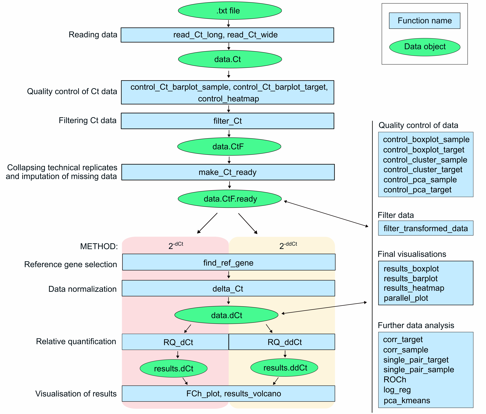
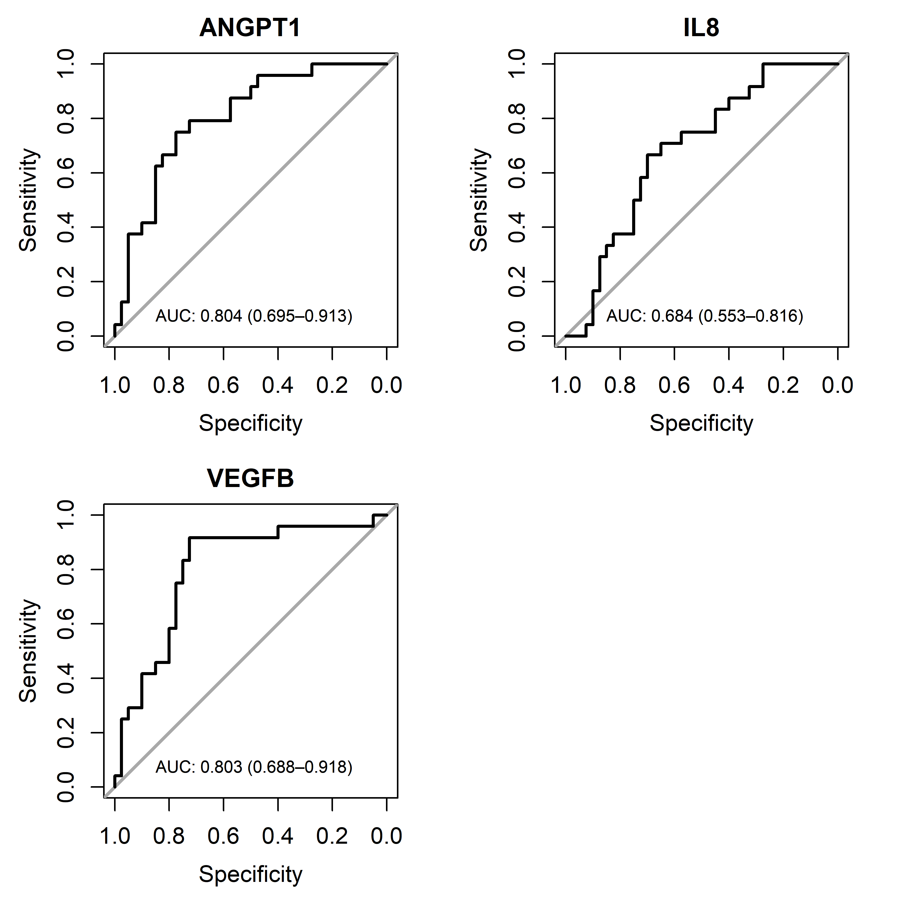

```{r, include = FALSE}
knitr::opts_chunk$set(
  collapse = TRUE,
  comment = "#>",
  message = FALSE,
  warning = FALSE,
  cache = FALSE
)
```

## Table of contents

* [**Introduction**]
  + [The summary of standard workflow]
* [**Data import**]
  + [Reading long-format data using the `read_Ct_long()` function]
  + [Reading wide-format data using the `read_Ct_wide()` function]
  + [Other methods]
  
* [**Part A: The workflow for analysis of independent groups of samples**]

* [Quality control of raw Ct data]
* [Filtering of raw Ct data]
* [Collapsing technical replicates and imputation of missing data - `make_Ct_ready()` function]
* [Reference gene selection]
* [Data normalization using reference gene]
* [Quality control and filtering of normalized Ct data]
  + [Analysis of data distribution]
  + [Hierarchical clustering]
  + [PCA analysis]
* [Data filtering after quality control]
* [Relative quantification: 2^-dCt^ method]
* [Relative quantification: 2^-ddCt^ method]
* [Final visualisations]
  + [The `FCh_plot()` function]
  + [The `results_volcano()` function]
  + [The `results_boxplot()` function]
  + [The `results_barplot()` function]
  + [The `results_heatmap()` function]
* [Further analyses]
  + [PCA and k means clustering]
  + [Correlation analysis]
  + [Simple linear regression analysis]
  + [Receiver Operating Characteristic (ROC) analysis]
  + [Simple logistic regression]

* [**Part B: A pairwise analysis**]

* [Quality control of raw Ct data (a pairwise approach)]
* [Filtering of raw Ct data (a pairwise approach)]
* [Collapsing technical replicates and imputation of missing data - `make_Ct_ready()` function (a pairwise approach)]
* [Reference gene selection (a pairwise approach)]
* [Data normalization using reference gene (a pairwise approach)]
* [Quality control and filtering of normalized Ct data (a pairwise approach)]
  + [Analysis of data distribution (a pairwise approach)]
  + [Hierarchical clustering (a pairwise approach)]
  + [PCA analysis (a pairwise approach)]
* [Data filtering after quality control (a pairwise approach)]
* [Relative quantification: 2^-dCt^ method (a pairwise approach)]
* [Relative quantification: 2^-ddCt^ method (a pairwise approach)]
* [Final visualisations (a pairwise approach)]
  + [The `FCh_plot()` function (a pairwise approach)]
  + [The `results_volcano()` function (a pairwise approach)]
  + [The `results_boxplot()` function (a pairwise approach)]
  + [The `results_barplot()` function (a pairwise approach)]
  + [The `results_heatmap()` function (a pairwise approach)]
  + [The `parallel_plot()` function (a pairwise approach)]
* [Further analyses (a pairwise approach)]
  + [PCA and k means clustering (a pairwise approach)]
  + [Correlation analysis (a pairwise approach)]
  + [Simple linear regression analysis (a pairwise approach)]
  + [Receiver Operating Characteristic (ROC) analysis (a pairwise approach)]
  + [Simple logistic regression (a pairwise approach)]

* [**Part C: Analysis of more than two groups**]

  + [Quality control of raw Ct data - a multigroup variant of analysis]
  + [Filtering of raw Ct data, collapsing technical replicates, and imputation of missing data - a multigroup variant of analysis]
  + [Reference gene selection - a multigroup variant of analysis]
  + [Data normalization using reference gene - a multigroup variant of analysis]
  + [Quality control and filtering of normalized Ct data - a multigroup variant of analysis]
  + [Data filtering after quality control - a multigroup variant of analysis]
  + [Relative quantification: 2^-dCt^ and 2^-ddCt^ methods - a multigroup variant of analysis]
  + [Final visualisations - a multigroup variant of analysis]
  + [Further analyses - a multigroup variant of analysis]
* [**Session info**]

## **Introduction**
`RQdeltaCT` is an R package developed to perform relative quantification of gene expression using delta Ct methods proposed by Kenneth J. Livak and Thomas D. Schmittgen in [Article1](https://doi.org/10.1006/meth.2001.1262) and [Article2](https://www.nature.com/articles/nprot.2008.73).

These methods were designed to analyse gene expression data (Ct values) obtained from real-time PCR experiments. The main idea is to normalise gene expression values using endogenous control gene (or genes), present gene expression levels in linear form using the 2^-(value)^ transformation, and calculate differences in gene expression levels between groups of samples (or technical replicates of a single sample).

Two main delta Ct methods are used for relative quantification. The choice of the best method depends on the study design. A short description of these methods is provided below; for more details, refer to the articles in the links provided.

1. **2^-dCt^ method.** In this method, Ct values are normalised by the endogenous control gene (often GAPDH, beta-actin, or other) by subtracting the Ct value of the endogenous control in each sample from the Ct value of the gene of interest in the same samples, obtaining delta Ct (dCt) values. Subsequently, the dCt values are transformed using the 2^-dCt^ formula, summarised by means in the compared study groups, and a ratio of means (fold change) is calculated for a study group. This method is useful in scenarios where samples should be analysed as individual data points, e.g., in comparison between patients and healthy subjects. See example no 5. in [Article2](https://www.nature.com/articles/nprot.2008.73).

2. **2^-ddCt^ method.** Similar to the 2^-dCt^ method, Ct values are normalised by endogenous control gene, but the obtained delta Ct (dCt) values are not exponentially transformed, but are summarised by means in the compared study groups, and the mean dCt in a control group is subtracted from the mean dCt in a study group, giving the delta delta Ct (ddCt) value. Subsequently, ddCt values are transformed using the 2^-ddCt^ formula to obtain the fold change value (also called the RQ value). This method is useful when a compared groups contain technical rather than biological replicates, e.g. where samples of cell line before adding stimulant are compared to samples of the same cell line after stimulation. See examples no. 1 and 2 in [Article2](https://www.nature.com/articles/nprot.2008.73).  

The presented `RQdeltaCT` package includes functions that encompass both of these methods, either for comparison of independent groups of samples or groups with paired samples (pairwise analysis). The selection of a suitable method for analysis is up to the user.  

---

To install and load the `RQdeltaCT` package simply run:
```{r eval=FALSE}
remotes::install_github("Donadelnal/RQdeltaCT")
library(RQdeltaCT)
```

The functions developed within the `RQdeltaCT` package are designed to be maximally easy to use, even for users who are beginners to R. The parameters of functions were prepared to sufficiently range all essential tasks and options, and no additional, extensive coding steps are necessary in standard workflow. The package was developed with the intention of being user-friendly and providing an opportunity to perform relative quantification analysis of gene expression using the `RQdeltaCT` package by non-experts in R programming (only basic programming skills are required).   

###### The summary of standard workflow

```{r echo=FALSE, out.width="650px", dpi = 600, fig.align="center", warning=FALSE, message=FALSE, cache=FALSE}

```

The entire standard workflow of analysis performed using the `RQdeltaCT` package requires the following external packages: 

* `tidyverse` - main package for data processing (`dplyr`, `tidyr`) and visualisation (`ggplot2`),
* `coin` - used to perform the Mann-Whitney U test (`wilcox_test()` function),
* `ctrlGene` - used to calculate gene expression stability score using geNorm algorithm,
* `ggsignif` - used to add significance labels to plots,
* `Hmisc` - used to perform correlation analysis (`rcor()` function),
* `corrplot` - used to visualise results of correlation analysis (`corrplot()` function),
* `ggpmisc` - used to add linear regression results to the plot (`stat_poly_eq()` function),
* `pROC` - used to perform analysis (`roc()` function),
* `oddsratio` - used to compute odds ratio values (`or_glm()` function),
* `GGally` - used to illustrate a pairwise changes in gene expression (`ggparcoord()` function). 

All plots created by the functions of the `RQdeltaCT` package can be saved as a .tiff files in the working directory (if `save.to.tiff` parameter is set to `TRUE`). The user can specify the image resolution, dimensions, and name. Firthermore, all generated tables can be saved as .txt files (if `save.to.txt` parameter is set to `TRUE`) with name specified by the user.

This vignette includes instructions and examples of the usage of the main parameters of functions from the `RQdeltaCT` package. The description of all available parameters is provided in the documentation of a particular function.

---

## **Data import**
Data analysed using the `RQdeltaCT` package should be in tabular form and contain the following information: group names, sample names, gene names, and Ct values. Flag information can also be included for data-filtering purposes. Any other information could exist in the data (the user does not have to remove them), but will not be used for analysis.

Files with such tables can typically be exported from software coupled with PCR devices and used to analyse raw data files generated during real-time PCR experiments. Such files are also returned by external software, such as [SDS](https://www.thermofisher.com/de/de/home/technical-resources/software-downloads/applied-biosystems-7900ht-fast-real-timespcr-system.html), or even R packages, e.g. [qpcR](https://doi.org/10.1093/bioinformatics/btn227)   

For user convenience, the `RQdeltaCT` package provides two functions that are useful to importing tables in .txt or csv. format:

* `read_Ct_long()` - to import tables with a long-format structure (each information in columns),
* `read_Ct_wide()` - to import tables with a wide-format structure (samples by columns, genes by rows).  

**NOTE:** Imported tables must be free of empty lines. 

All datasets used in this chapter are a part of real data used in  this [article](https://doi.org/10.3390/ijms241512087). The tables contain samples divided into two groups: AAA group (patients with abdominal aortic aneurysm) and Control group (subjects without AAA). For each sample, the expression of 19 genes was determined as Ct values, obtained using real-time PCR and TaqMan assays.

#### Reading long-format data using the `read_Ct_long()` function

Example of a long-format table with a structure suitable for the `read_Ct_long()` function:

| Group | Sample | Gene | Ct | Flag |
|:--------|:---------|:------|:-----|:----|
| Disease | Disease1 | Gene1 | 25.6 | OK |
| Disease | Disease2 | Gene2 | 32.9 | Undetermined |
| Control | Control1 | Gene1 | Undetermined | OK |
| Control | Control2 | Gene2 | 27.5 | OK |
| ... | ... | ... | ... | ...|


For the purpose of presentating the `read_Ct_long()` function, the long-format .txt table (data_Ct_long.txt) located in `RQdeltaCt` package directory will be imported:

```{r message=FALSE, cache=FALSE}
# Set path to file:
path <- system.file("extdata",
                    "data_Ct_long.txt",
                    package = "RQdeltaCT")

# Import file using path; remember to specify proper separator, decimal character, and number of necessary columns:
library(RQdeltaCT)
library(tidyverse)
data.Ct <- read_Ct_long(path = path,
                        sep = "\t",
                        dec = ".",
                        skip = 0,
                        add.column.Flag = TRUE,
                        column.Sample = 1,
                        column.Gene = 2,
                        column.Ct = 5,
                        column.Group = 9,
                        column.Flag = 4)
```

Let's look at the data structure:
```{r cache=FALSE}
str(data.Ct)
```

The data were imported properly; however, the Flag variable is numeric, but a character or factor is required. This variable contains a numeric AmpScore parameter, which is often used to evaluate the quality of the amplification curve - curves with AmpScore below 1 are typically considered as low quality and removed from data during analysis. Therefore, the Flag variable can be changed into character by transforming the numeric AmpScore parameter into a binary variable that contains values "OK" and "Undetermined" according to the applied AmpScore criterion:

```{r, cache=FALSE}
library(tidyverse)
data.Ct <- mutate(data.Ct,
                  Flag = ifelse(Flag < 1, "Undetermined", "OK"))
str(data.Ct)
```

In this transformation, all AmpScore values in the Flag column that are below 1 were changed to "Undetermined", otherwise to "OK". The Flag variable now is a character, as required, and the data are ready for further analysis.

#### Reading wide-format data using the `read_Ct_wide()` function

The `read_Ct_wide()` function was designed to import data with Ct data in the form of a wide-format table (with sample names in the first row and gene names in the first column). Because such a structure does not include names of groups, an additional file containing group names and assigned samples is required. This second file must contain two columns: column named "Sample" with the names of the samples and column named "Group" with the names of the groups assigned to the samples. The names of the samples in this file must be the same as those of the columns in the file with Ct values (the order does not have to be kept).

Example structure of a wide-format table suitable for the `read_Ct_wide()` function:

| Gene | Sample1 | Sample2 | Sample3 | ... |
|:--------|:---------|:------|:-----|:----|
| Gene1 | 25.4 | 24.9 | 25.6 | ... |
| Gene2 | 21.6 | 22.5 | 20.8 | ... |
| Gene3 | 33.7 | Undetermined | Undetermined | ... |
| Gene4 | 15.8 | 16.2 | 17.5 | ... |
| ... | ... | ... | ... | ...|

Example structure of an additional file suitable for the `read_Ct_wide()` function:

| Sample | Group |
|:--------|:--------|
| Sample1 | Control |
| Sample2 | Control |
| Sample3 | Disease |
| Sample4 | Disease |
| ... | ... |

In the following example, the `read_Ct_wide()` function was used to import and merge a wide-format file with Ct values (data_Ct_wide.txt) and a file with names of groups (data_design.txt) located in `RQdeltaCt` package directory:

```{r cache=FALSE}
# Set paths to required files: 
path.Ct.file <- system.file("extdata",
                            "data_Ct_wide.txt",
                            package = "RQdeltaCT")
path.design.file <- system.file("extdata",
                                "data_design.txt",
                                package = "RQdeltaCT")

# Import files:
library(tidyverse)
data.Ct <- read_Ct_wide(path.Ct.file = path.Ct.file,
                        path.design.file = path.design.file,
                        sep ="\t",
                        dec = ".")

# Look at the structure:
str(data.Ct)
```

The table imported from the package data object can be directly subjected to further analysis. 

#### Other methods

It can also be a situation in which an imported wide-format table has samples by rows and genes by columns. There is no need to develop a separate function to import files with such a table, the following code can be used to imports such a file:

```{r cache=FALSE}
# Import file, be aware of specifying parameters that fit the imported data:
data.Ct.wide <- read.csv(file = "data/data.Ct.wide.vign.txt",
                         header = TRUE,
                         sep = ",")
str(data.Ct.wide)

# The imported table is now transformed into a long-format structure.  
library(tidyverse)
data.Ct <- data.Ct.wide %>%
             select(-X) %>% # The "X" column is unnecessary and is removed.
             mutate(across(everything(), as.character)) %>% # All variables also are converted to a character to unify the class of variables.
             pivot_longer(cols = -c(Group, Sample), names_to = "Gene", values_to = "Ct")
str(data.Ct)
```

**NOTE:** At this stage, the Ct values do not have to be numeric.

**NOTE: Data can also be imported to R using the user's own code, but the final object must be a data frame and contain a table with a column named "Sample" with sample names, column named "Gene" with gene names, column named "Ct" with raw Ct values, column named "Group" with group names, and optionally column named "Flag" containing flag information (this column should be a class of character or factor).**

---

For package testing purposes, it is also convenient to use the data objects included in the `RQdeltaCT` package, named `data.Ct` (the data with independent groups of samples) and `data.Ct.pairwise` (with dependent groups of samples, can be used for a pairwise analysis):

```{r cache=FALSE}
data(data.Ct)
str(data.Ct)

data(data.Ct.pairwise)
str(data.Ct.pairwise)
```

The `data.Ct.pairwise` data are a part of the `data.Ct` data, with a structure transformed to fit a pairwise analysis. Because the data did not come from paired experiments, the sample names, gene names, and group names were  encoded. The number of samples in the study group (named "Before") has been equated with the number of the reference group (named "After"). These data are used in this vignette to demonstrate a pairwise approach to the relative quantification of gene expression (see [**Part B: A pairwise analysis**] chapter). 


---

# **Part A: The workflow for analysis of independent groups of samples**

The `RQdeltaCT` package allows to perform analysis in two variants: a comparison of independent groups of samples and a pairwise comparison of dependent groups of samples. Independent groups contain different samples without inter-group relations. An example of such an analysis is the comparison of patients with a disease vs. healthy controls. In the pairwise approach, the groups contain either the same set of subjects or different, but paired subjects. An example of pairwise analysis is the comparison between the same patients before and after medical intervention. This part of the vignette contains instructions for analysis of independent groups, for the pairwise variant of the workflow refer to [**Part B: A pairwise analysis**]. 

## Quality control of raw Ct data

The crucial step of each data analysis is an assessment of the quality and usefulness of the data used to investigate the studied problem. The `RQdeltaCT` package offers two functions for quality control of raw Ct data: `control_Ct_barplot_sample()` (for quality control of samples) and  `control_Ct_barplot_gene()` (for quality control of genes). Both functions require specifying quality control criteria to be applied to Ct values, in order to label each Ct value as reliable or not reliable. These functions return numbers of reliable and unreliable Ct values in each sample or each gene, as well as total number of Ct values obtained from each sample and each gene. These results are presented graphically on barplots. The obtained results are useful for inspecting the analysed data in order to identify samples and genes that should be considered to be removed from the data (based on the applied reliability criteria).  

Three selection criteria can be set for these functions:  

* a flag used for undetermined Ct values. Default to "Undetermined".
* a maximum of Ct value allowed. Default to 35.
* a flag used in the Flag column for values which are unreliable. Default to "Undetermined".

**NOTE:** These functions do not perform data filtering, but only report numbers of Ct values labelled as reliable or not and present them graphically.  

An example of the use of these functions is provided below:

```{r fig.dim=c(7.1,7), cache=FALSE}
sample.Ct.control <- control_Ct_barplot_sample(data = data.Ct,
                                               flag.Ct = "Undetermined",
                                               maxCt = 35,
                                               flag = c("Undetermined"),
                                               axis.title.size = 9,
                                               axis.text.size = 7,
                                               plot.title.size = 9,
                                               legend.title.size = 9,
                                               legend.text.size = 9)

```
```{r fig.dim=c(7.1,5.5), cache=FALSE}
gene.Ct.control <- control_Ct_barplot_gene(data = data.Ct,
                                           flag.Ct = "Undetermined",
                                           maxCt = 35,
                                           flag = c("Undetermined"),
                                           axis.title.size = 9,
                                           axis.text.size = 9,
                                           plot.title.size = 9,
                                           legend.title.size = 9,
                                           legend.text.size = 9)
```

The created plots are displayed on the graphic device, and short information about the returned tables appears. Returned objects are lists that contain two elements: an object with a plot and a table with numbers of Ct values labelled as reliable (Yes) and unreliable (No), as well as a fraction of unreliable Ct values in each gene. To easily identify samples or genes with high number of unreliable values, tables are sorted to show them at the top. To access the returned tables, the second element of returned objects should be called:

```{r cache=FALSE}
head(sample.Ct.control[[2]])
```

```{r cache=FALSE}
head(gene.Ct.control[[2]])
```

To gain deeper insight into the number of replicates by genes and samples, the `control_heatmap()` function can be used:

```{r fig.dim=c(7.1,8), cache=FALSE}
library(tidyverse)
library(pheatmap)
data(data.Ct)

# Vector of colors to fill the heatmap can be specified to fit the user's needs:
colors <- c("#4575B4","#FFFFBF","#C32B23")
control_heatmap(data.Ct,
                sel.Gene = "all",
                colors = colors,
                show.colnames = TRUE,
                show.rownames = TRUE, 
                fontsize = 9,
                fontsize.row = 9,
                angle.col = 45)
```

The created plot is displayed on the graphic device (if `save.to.tiff = FALSE`) or saved to .tiff file (if `save.to.tiff = TRUE`).

**NOTE:** The `control_heatmap()` works only if various numbers of replicates are in the data, otherwise error will appear because the inherited `pheatmap()` function can not deal with the situation where all values are equal.

Visual inspection of returned plots and obtained tables gives a clear image of data quality. The results obtained in the examples show that the AAA group contains more samples than the Control group. Some samples have more Ct values (more technical replicates) than other samples. Furthermore, in all samples, the majority of Ct values are reliable.  

Regarding genes, GAPDH and FGF23 were investigated in duplicates in the Control group, while other genes have single Ct values in both groups. Furthermore, FGF23 was analysed only in the Control group and has all values labeled as unreliable; therefore, it is obvious that this gene should be excluded from the analysis. Some other genes also have many unreliable Ct values (e.g. ANGPT2, IL1A) and maybe should be considered to be removed from the data.  

In some situations, a unified fraction of unreliable data need to be established and used to make decision which samples or genes should be excluded from the analysis. This can be done using the following code, in which the second element of object returned by the `control_Ct_barplot_sample()` and `control_Ct_barplot_gene()` functions can be used directly, and a vector with samples or genes for which the fraction of unreliable Ct values is higher than a specified threshold is received: 

```{r cache=FALSE}
# Finding samples with more than half of the unreliable Ct values.
low.quality.samples <- filter(sample.Ct.control[[2]], Not.reliable.fraction > 0.5)$Sample
low.quality.samples <- as.vector(low.quality.samples)                        
low.quality.samples
```

```{r}
# Finding genes with more than half of the unreliable Ct values in given group.
low.quality.genes <- filter(gene.Ct.control[[2]], Not.reliable.fraction > 0.5)$Gene
low.quality.genes <- unique(as.vector(low.quality.genes))                        
low.quality.genes
```

In the above examples, there is no sample with more than half of the unreliable data. Furthermore, this criterion was met by 5 genes (FGF23, ANGPT2, IL1A, CSF2, and IL6); therefore, these genes will be removed from the data in the next step of analysis. 

---

## Filtering of raw Ct data

When reliability criteria are finally established for Ct values, and some samples or genes are decided to be excluded from the analysis after quality control of the data, the data with raw Ct values can be filtered using the `filter_Ct()` function.  

As a filtering criteria, a flag used for undetermined Ct values, a maximum of Ct threshold, and a flag used in Flag column can be applied. Furthermore, vectors with samples, genes, and groups to be removed can also be specified:

```{r cache=FALSE}
# Objects returned from the `low_quality_samples()` and `low_quality_genes()`functions can be used directly:
data.CtF <- filter_Ct(data = data.Ct,
                      flag.Ct = "Undetermined",
                      maxCt = 35,
                      flag = c("Undetermined"),
                      remove.Gene = low.quality.genes,
                      remove.Sample = low.quality.samples)

# Check dimensions of data before and after filtering:
dim(data.Ct)
dim(data.CtF)
```

**NOTE:** If data contain more than two groups, it is good practice to remove groups that are out of comparison; however, a majority of other functions can deal with more groups unless only two groups are indicated to be given in function's parameters. For more details refer to chapter [**Analysis of more than two groups**].

---

## Collapsing technical replicates and imputation of missing data - `make_Ct_ready()` function

In the next step, filtered Ct data can be subjected to collapsing of technical replicates and data imputation by means within groups using the `make_Ct_ready()` function. 

The term 'technical replicates' means observations with the same group name, gene name, and sample name. In the scenario when data contain technical replicates but they should not be collapsed, these technical replicates must be distinguished by different sample names, e.g. Sample1_1, Sample1_2, Sample1_3, etc.  

The parameter `imput.by.mean.within.groups` can be used to control data imputation. If it is set to `TRUE`, imputation will be done, otherwise missing values will remain in the data. For a better view of the amount of missing values in the data, the information about the number and percentage of missing values is displayed automatically:  

```{r cache=FALSE}
# Without imputation:
data.CtF.ready <- make_Ct_ready(data = data.CtF,
                                imput.by.mean.within.groups = FALSE)
# A part of the data with missing values:
as.data.frame(data.CtF.ready)[19:25,]

# With imputation:
data.CtF.ready <- make_Ct_ready(data = data.CtF,
                                imput.by.mean.within.groups = TRUE)
# Missing values were imputed:
as.data.frame(data.CtF.ready)[19:25,]
```

**NOTE:** The data imputation process can significantly influence the data; therefore, no default value was set to the `imput.by.mean.within.groups` parameter in order to force the specification by the user. If there are missing data for a certain gene in the entire group, they will not be imputed and will remain NA. 

In general, a majority of functions in the `RQdeltaCT` package can deal with missing data; however, some used methods (e.g. PCA) are sensitive to missing data (see [PCA analysis] section). 

**NOTE: The `make_Ct_ready()` function should be used even if the collapsing of technical replicates and data imputation is not required, because this function also prepares the data structure to fit to further functions.**  

---

## Reference gene selection

Ideally, the reference gene should have an identical expression level in all samples, but in many situations it is not possible to achieve this, especially when biological replicates are analysed. Therefore, differences between samples are allowed, but the variance should be as low as possible, and it is also recommended that Ct values should not be very low (below 15) or very high (above 30) [Article](https://link.springer.com/article/10.1007/s13353-013-0173-x).  

The `RQdeltaCT` package includes `find_ref_gene()` function that can be used to select the best reference gene for normalisation. This function calculates descriptive statistics, such as minimum, maximum, standard deviation, and variance, as well as stability scores calculated using the [NormFinder](https://www.moma.dk/software/normfinder) ([Article](https://doi.org/10.1158/0008-5472.CAN-04-0496)) and [geNorm](https://genorm.cmgg.be/) ([Article](https://genomebiology.biomedcentral.com/articles/10.1186/gb-2002-3-7-research0034)) algorithms. Ct values are also presented on a line plot.  

NormFinder scores are computed using the internal `RQdeltaCT::norm_finder()` function working on the code adapted from the original NormFinder code. To calculate NormFinder scores, at least two samples must be present in each group. For the geNorm score, the `geNorm()` function of the `ctrlGene` package is used. 

The `find_ref_gene()` function in the `RQdeltaCT` package allows one to choose which of these algorithms should be done by setting the logical parameters: `norm.finder.score` and `genorm.score`. The returned object is a list that contains two elements: an object with plot and a table with results. In the example below, six genes are tested for suitability to be a reference gene: 

```{r fig.dim=c(7.1,4), cache=FALSE}
library(ctrlGene)
# Remember that the number of colors in col parameter should be equal to the number of tested genes:
ref <- find_ref_gene(data = data.CtF.ready,
                     groups = c("AAA","Control"),
                     candidates = c("CCL5", "IL1B","GAPDH","TGFB","TNF", "VEGFA"),
                     col = c("#66c2a5", "#fc8d62","#6A6599", "#D62728", "#1F77B4", "black"),
                     angle = 60,
                     axis.text.size = 7,
                     norm.finder.score = TRUE,
                     genorm.score = TRUE)
ref[[2]]
```

The created plot is displayed on the graphic device. 
NA values are presented because geNorm method returns a pair of genes with the highest stability.  
Among tested genes, GAPDH, TNF, TGFB, and VEGFA seem to have the best characteristics to be a reference gene (they have low variance, low NormFinder and geNorm scores).

---

## Data normalization using reference gene

Data normalization can be performed using `delta_Ct()` function that calculates delta Ct (dCt) values by subtracting Ct values of reference gene (or mean of the Ct values of reference genes, if more than one reference gene is used) from Ct values of gene of interest across all samples. If 2^-dCt^ method is used, `transform` should be set to `TRUE` to tansform dCt values using 2^-dCt^ formula:

```{r cache=FALSE}
# For 2^-dCt^ method:
data.dCt.exp <- delta_Ct(data = data.CtF.ready,
                         normalise = TRUE,
                         ref = "GAPDH",
                         transform = TRUE)
```

If 2^-ddCt^ method is used, `transform` should be set to `FALSE` to avoid dCt values transformation that is performed later by the consecutive `RQ_ddCt()` function.

```{r cache=FALSE}
# For 2^-ddCt^ method:
data.dCt <- delta_Ct(data = data.CtF.ready,
                     normalise = TRUE,
                     ref = "GAPDH",
                     transform = FALSE)
```

**NOTE:** In the scenario where unnormalised data should be analysed, the `normalise` parameter should be set to `FALSE`.

**Before further processing, non-transformed or transformed dCt data should be subjected to quality control using functions and methods described in [Quality control and filtering of transformed Ct data] section (see below).**  

---

## Quality control and filtering of normalized Ct data

Normalized data intended for relative quantification should be subjected to quality assessment. The main purpose is to identify outlier samples that could introduce bias into the results. The `RQdeltaCT` package offers several functions which facilitate finding outlier samples in data by implementing distribution analysis (`control_boxplot_sample()` function), hierarchical clustering (`control_cluster_sample()` function) and principal component analysis PCA (`control_pca_sample()` function). Furthermore, corresponding functions are also provided for genes to evaluate similarities and differences between expression of analysed genes (`control_boxplot_gene()`, `control_cluster_gene()` and `control_pca_gene()` functions).

**The abovementioned data quality control functions are designed to be directly applied to data objects returned from the `make_Ct_ready()` and `delta_Ct()` functions (see [The summary of standard workflow]).**

#### Analysis of data distribution

One of the ways to gain insight into data distribution is drawing boxplot that show several statistics, such as median (labelled inside box), first and third quartiles (ranged by box), extreme point in interquartile range (ranged by whiskers), and more distant data as separated points. In the `RQdeltaCT` package, the `control_boxplot_sample()` and `control_boxplot_gene()` functions are included to draw boxplots that present the distribution of samples and genes, respectively.

```{r fig.dim=c(7.1,6), cache=FALSE}
control_boxplot_sample <- control_boxplot_sample(data = data.dCt,
                                                 y.axis.title = "dCt",
                                                 axis.text.size = 7)
```
```{r fig.dim=c(7.1,4)}
control_boxplot_gene <- control_boxplot_gene(data = data.dCt,
                                             by.group = TRUE,
                                             y.axis.title = "dCt",
                                             axis.text.size = 10)
```

These functions return objects with a plot. The created plots are also displayed on the graphic device.

**NOTE:** If missing values are present in the data, they will be automatically removed with warning.

#### Hierarchical clustering

Hierarchical clustering is a convenient method to investigate similarities between variables. Hierarchical clustering of samples and genes can be done using the `control_cluster_sample()` and `control_cluster_gene()` functions, respectively. These functions allow drawing dendrograms using various methods of distance calculation (e.g. euclidean, canberra) and agglomeration (e.g. complete, average, single). For more details, refer to the functions documentation.

```{r fig.dim=c(7.1,4), cache=FALSE}
control_cluster_sample(data = data.dCt,
                       method.dist = "euclidean",
                       method.clust = "average",
                       label.size = 0.6)
control_cluster_gene(data = data.dCt,
                     method.dist = "euclidean",
                     method.clust = "average",
                     label.size = 0.8)
```

The created plots are displayed on the graphic device.

**NOTE:** Minimum three samples or genes in data is required for clustering analysis.

#### PCA analysis

Principal component analysis (PCA) is a data exploratory method, that is commonly used to investigate similarities between variables based on the first principal components that contain the most information about variance. In the `RQdeltaCT` package, the `control_pca_sample()` and `control_pca_gene()` functions are developed to perform PCA analysis for samples and genes, respectively. These functions return objects with a plot. Created plots are also displayed on the graphic device.

```{r fig.dim=c(4,4.5), fig.align='center', cache=FALSE}
control.pca.sample <- control_pca_sample(data = data.dCt,
                                         point.size = 3,
                                         label.size = 2.5,
                                         legend.position = "top")
```
```{r fig.dim=c(4,4), fig.align='center', cache=FALSE}
control.pca.gene <- control_pca_gene(data = data.dCt)
```

**NOTE:** PCA algorithm can not deal with missing data (NAs); therefore, variables with NA values are removed before analysis. If at least one NA value occurs in all variables in at least one of the compared group, the analysis can not be done. Imputation of missing data will avoid this issue. Also, a minimum of three samples or genes in the data are required for analysis.

---

## Data filtering after quality control

If any sample or gene was decided to be removed from the data, the `filter_transformed_data()` function can be used for filtering. Similarly to quality control functions, this function can be directly applied to data objects returned from the `make_Ct_ready()` and `delta_Ct()` functions (see [The summary of standard workflow]). 

```{r cache=FALSE}
data.dCtF <- filter_transformed_data(data = data.dCt,
                                     remove.Sample = c("Control11"))
```

---

## Relative quantification: 2^-dCt^ method

This method is used in studies where samples should be analysed as individual data points, e.g. in analysis of biological replicates. In this method, Ct values are normalised by the endogenous control gene by subtracting the Ct value of the endogenous control from the Ct value of the gene of interest, in the same sample. Obtained delta Ct (dCt) values are subsequently transformed using the 2^-dCt^ formula, summarised by means in the compared study groups, and a ratio of means (fold change) is calculated for the study group (see [**Introduction**] section).  

The whole process can be done using `RQ_dCt()` function, which performs:

* calculation of means (returned in columns with the "_mean" pattern) and standard deviations (returned in columns with the "_sd" pattern) of transformed dCt values of genes analysed in the compared groups.
* normality testing (Shapiro_Wilk test) of transformed dCt values of analysed genes in compared groups and returned p values are stored in columns with the "_norm_p" pattern.
* calculation of fold change values for each gene by dividing the mean of transformed dCt values in the study group by the mean of transformed dCt values in the reference group. Fold change values are returned in the "FCh" column.
* statistical testing of differences in transformed Ct values between the study group and the reference group. Student's t test and Mann-Whitney U test are implemented and the resulting statistics (in column with the "_test_stat" pattern), p values (in column with the "_test_p" pattern), and adjusted p values (in column with the "_test_p_adj" pattern) are returned. The Benjamini-Hochberg method for adjustment of p values is used in default. If compared groups contain less than three samples, normality and statistical tests are not possible to perform (the `do.test` parameter should be set to `FALSE` to avoid error).  
  
**NOTE:** For this method, delta Ct (dCt) values transformed by the 2^-dCt^ formula using `delta_Ct()` function (called with `transform = TRUE`) should be used.

```{r cache=FALSE}
data.dCt.exp <- delta_Ct(data = data.CtF.ready,
                         ref = "GAPDH",
                         transform = TRUE)
library(coin)
results.dCt <- RQ_dCt(data = data.dCt.exp,
                      do.tests = TRUE,
                      group.study = "AAA",
                      group.ref = "Control")

# Obtained table can be sorted by, e.g. p values from the Mann-Whitney U test:
head(as.data.frame(arrange(results.dCt, MW_test_p)))
```

---

## Relative quantification: 2^-ddCt^ method

Similarly to the 2^-dCt^ method, in the 2^-ddCt^ method Ct values are normalised by the endogenous control gene, obtaining dCt values. Subsequently, dCt values are summarised by means in the compared groups, and for each gene, the obtained mean in the control group is subtracted from the mean in the study group, giving the delta delta Ct (ddCt) value. Finally, the ddCt values are transformed using the 2^-ddCt^ formula to obtain the fold change values. This method is recommended for analysis of technical replicates (see the [**Introduction**] section).

The whole process can be done using `RQ_ddCt()` function, which performs:

* calculation of means (returned in columns with the "_mean" pattern) and standard deviations (returned in columns with the "_sd" pattern) of delta Ct values of the analyzed genes in the compared groups.
* normality testing (Shapiro_Wilk test) of delta Ct values of the analyzed genes in the compared groups and returned p values are stored in columns with the "_norm_p" pattern.
* calculation of differences in the mean delta Ct values of genes between compared groups, returned in "ddCt" column,
* calculation of fold change values (returned in "FCh" column) for each gene by transforming the ddCt values using the 2^-ddCt^ formula.
* statistical testing of differences between the compared groups. Student's t test and Mann-Whitney U test are implemented and the resulted statistics (in column with the "_test_stat" pattern), p values (in column with the "_test_p" pattern) and adjusted p values (in column with the "_test_p_adj" pattern) are returned. The Benjamini-Hochberg method for adjustment of p values is used in default. If compared groups contain less than three samples, normality and statistical tests are not possible to perform and `do.test` parameter should be set to `FALSE` to avoid error. 
   
**NOTE:** For this method, not transformed delta Ct (dCt) values (obtained from `delta_Ct()` function with `transform = FALSE`) should be used.

```{r cache=FALSE}
data.dCt <- delta_Ct(data = data.CtF.ready,
                     ref = "GAPDH",
                     transform = FALSE)
library(coin)
results.ddCt <- RQ_ddCt(data = data.dCt,
                        group.study = "AAA",
                        group.ref = "Control",
                        do.tests = TRUE)

# Obtained table can be sorted by, e.g. p values from the Mann-Whitney U test:
head(as.data.frame(arrange(results.ddCt, MW_test_p)))
```

---

## Final visualisations

For visualisation of final results, the following functions can be used:

* `FCh_plot()` that allows to illustrate fold change values of genes,
* `results_volcano()` that allows to create volcano plot presenting the arrangement of fold change values and p values,
* `results_barplot()` that show mean and standard deviation values of genes across the compared groups,
* `results_boxplot()` that illustrate the data distribution of genes across the compared groups,
* `results_heatmap()` that allows to create heatmap with hierarchical clustering,

All these functions can be run on all data or on selected genes (see `sel.Gene` parameter). These functions have a large number of parameters, and the user should familiarise with all of them to properly adjust created plots to the user needs.

**NOTE:** The functions `FCh_plot()`, `results_barplot()`, and `results_boxplot()` also allow to add customised statistical significance labels to plots based on the incorporated `ggsignif` package functionalities. If statistical significance labels should be added to the plot, a vector with labels (e.g., "ns", "*", "p = 0.03") should be provided in the `signif.labels` parameter. There are two important points that must be taking into account when preparing this vector:

* The order of labels should correspond to the order of genes presented on the plot, not the order of genes in the data, which can be different.
* In this vector, due to restrictions of the `ggsignif` package, all values must be different (the same values are not allowed). Thus, if the same labels are needed, they should be distinguishable by adding symmetrically a different number of white spaces (see the examples below). 

#### The `FCh_plot()` function

This function creates a barplot that illustrates fold change values obtained from the analysis, together with an indication of statistical significance. Data returned from the `RQ_dCt()` and `RQ_ddCt()` functions can be directly applied to this function (see [The summary of standard workflow]).  

On the barplot, bars of significant genes are distinguished by colors and/or significance labels. The significance of genes can be established by two criteria: p values and (optionally) fold change values. Thresholds for both criteria can be specified. The `FCh_plot()` function offers various options of which p values are used on the plot:

* p values from the Student's t test (if `mode = "t"`).
* p values from the Mann-Whitney U test (if `mode = "mw"`).
* p values depend on the normality of data (if `mode = "depends"`). If the data in both compared groups were considered derived from normal distribution (p value of Shapiro_Wilk test > 0.05) - p values of Student's t test will be used, otherwise p values of Mann-Whitney U test will be used.
* external p values provided by the user (if `mode = "user"`). If the user intends to use the p values obtained from the other statistical test, the `mode` parameter should be set to "user". In this scenario, before running the `FCh_plot()` function, the user should prepare a data.frame object named "user" containing two columns: the first column with gene names and the second column with p values (see example below).

The created plot is displayed on the graphic device. The returned object is a lists that contain two elements: an object with plot and a table with results. 

```{r fig.dim=c(7.1,4), cache=FALSE}
# Variant with p values depending on the normality of the data:
library(ggsignif)
# Specifying vector with significance labels: 
signif.labels <- c("****",
                   "**",
                   "ns.",
                   " ns. ",
                   "  ns.  ",
                   "   ns.   ",
                   "    ns.    ",
                   "     ns.     ",
                   "      ns.      ",
                   "       ns.       ",
                   "        ns.        ",
                   "         ns.         ",
                   "          ns.          ",
                   "***")
# Genes with p < 0.05 and 2-fold changed expression between compared groups are considered significant: 
FCh.plot <- FCh_plot(data = results.ddCt,
                     use.p = TRUE,
                     mode = "depends",
                     p.threshold = 0.05,
                     use.FCh = TRUE,
                     FCh.threshold = 2,
                     signif.show = TRUE,
                     signif.labels = signif.labels,
                     angle = 20)
# Access the table with results:
head(as.data.frame(FCh.plot[[2]]))
```

A variant with user p values - the used p values are calculated using the `stats::wilcox.test()` function:

```{r fig.dim=c(7.1,4), cache=FALSE}
user <- data.dCt %>%
          pivot_longer(cols = -c(Group, Sample),
                       names_to = "Gene",
                       values_to = "dCt") %>%
          group_by(Gene) %>%
          summarise(MW_test_p = wilcox.test(dCt ~ Group)$p.value,
                    .groups = "keep")
# The stats::wilcox.test() functions is limited to cases without ties; 
# therefore, a warning "cannot compute exact p-value with ties" will appear when ties occur.

FCh.plot <- FCh_plot(data = results.ddCt,
                   use.p = TRUE,
                   mode = "user",
                   p.threshold = 0.05,
                   use.FCh = TRUE,
                   FCh.threshold = 2,
                   signif.show = TRUE,
                   signif.labels = signif.labels,
                   angle = 30)
# Access the table with results (p.used column was changed):
head(as.data.frame(FCh.plot[[2]]))
```

Three genes (ANGPT1, IL8, and VEGFB) are shown to meet the used significance criteria.

**NOTE:** If p values were not calculated due to the low number of samples, or they are not intended to be used to create a plot, the `use.p` parameter should be set to `FALSE`.

#### The `results_volcano()` function

This function creates a volcano plot that illustrates the arrangement of genes based on fold change values and p values. Significant genes can be pointed out using specified p value and fold change thresholds, and highlighted on the plot by color and (optionally) isolated by thresholds lines. Similarly to `FCh_plot()` function, data returned from the `RQ_dCt()` and `RQ_ddCt()` functions can be directly applied (see [The summary of standard workflow]) and various sources of used p values are available (from the Student's t test, the Mann-Whitney U test, depended on the normality of data, or provided by the user).  

The created plot is displayed on the graphic device. The returned object is a lists that contain two elements: an object with plot and a table with results. 

```{r fig.dim=c(4,4.5), fig.align='center', cache=FALSE}
# Genes with p < 0.05 and 2-fold changed expression between compared groups are considered significant: 
volcano <- results_volcano(data = results.ddCt,
                           mode = "depends",
                           p.threshold = 0.05,
                           FCh.threshold = 2)
# Access the table with results:
head(as.data.frame(volcano[[2]]))
```

#### The `results_boxplot()` function

This function creates a boxplot that illustrates the distribution of the data for the genes. It is similar to `control_boxplot_gene()` function; however, some new options are added, including gene selection, faceting, addition of mean points to boxes, and statistical significance labels.

Data objects returned from the `make_Ct_ready()` and `delta_Ct()` functions can be directly applied to this function (see [The summary of standard workflow]).

```{r fig.dim=c(5,4.5), fig.align='center', cache=FALSE}
final_boxplot <- results_boxplot(data = data.dCtF,
                                 sel.Gene = c("ANGPT1","IL8", "VEGFB"),
                                 by.group = TRUE,
                                 signif.show = TRUE,
                                 signif.labels = c("****","**","***"),
                                 signif.dist = 1.05,
                                 faceting = TRUE,
                                 facet.row = 1,
                                 facet.col = 4,
                                 y.exp.up = 0.1,
                                 angle = 20,
                                 y.axis.title = "dCt")
```

**NOTE:** If missing values are present in the data, they will be automatically removed, and a warning will appear.

**IMPORTANT NOTE:** Significance labels are properly located on the plot only if faceting is used (`faceting = TRUE`). For plots without faceting, coordinates of significance labels depends on the data and need to be individually provided (can not be added automatically). In such a situations, the following solution can be used.

**Step 1:** Prepare object that contain plot without faceting and significance labels: 
```{r fig.dim=c(5,4.5), fig.align='center', cache=FALSE}
final_boxplot_no_fac <- results_boxplot(data = data.dCtF,
                                        sel.Gene = c("ANGPT1","IL8", "VEGFB"),
                                        by.group = TRUE,
                                        signif.show = FALSE,  # Disable significance labels
                                        faceting = FALSE, # Disable faceting
                                        y.axis.title = "dCt") +
                                        theme(axis.text.x = element_text(size = 5, colour = "black"))

# Add x axis annotations and ticks:
final_boxplot_no_fac <- final_boxplot_no_fac + 
                         theme(axis.text.x = element_text(size = 11, colour = "black", face="italic"), # Use italic font for human gene symbols
                               axis.ticks.x = element_line(colour = "black"))
final_boxplot_no_fac
```

**Step 2:** Prepare tables with coordinates for significance labels:

```{r cache=FALSE}
data.label <- data.frame(matrix(nrow = 3, ncol = 4)) # Number of rows should be equal to number of genes 
rownames(data.label) <- c("ANGPT1","IL8","VEGFB")
colnames(data.label) <- c("x", "xend", "y", "annotation")
data.label$Gene <- rownames(data.label)

data.label$y <- 1 + c(max(data.dCtF$ANGPT1), max(data.dCtF$IL8), max(data.dCtF$VEGFB))
data.label$x <- c(0.81,1.81,2.81)
data.label$xend <- c(1.19,2.19,3.19)
data.label$annotation <- c("****","**","***")
```

**Step 3:** Add significance labels to the plot:

```{r fig.dim=c(5,4.5), fig.align='center', cache=FALSE}
final_boxplot_no_fac_ok <- final_boxplot_no_fac +
                            geom_signif(annotation = data.label$annotation, 
                                        y_position = data.label$y, 
                                        xmin = data.label$x, 
                                        xmax = data.label$xend,
                                        tip_length = 0.01,
                                        textsize = 5)
final_boxplot_no_fac_ok
```

**Step 4:** Minor improvement and the plot is ready! 

```{r fig.dim=c(5,4.5), fig.align='center', cache=FALSE}
final_boxplot_no_fac_ok <- final_boxplot_no_fac_ok +
                            scale_y_continuous(expand = expansion(mult = c(0.1, 0.15))) # Make room for the first label
                            
final_boxplot_no_fac_ok
```

___
A situation may arise in which the user prefers to generate a faceted plot without a color legend, displaying group names as annotations on the x axis. This can be the solution for this situation:

```{r fig.dim=c(5,3.5), fig.align='center', cache=FALSE}
library(tidyverse)
colnames(data.dCtF)
data.dCtF.slim <- pivot_longer(data.dCtF, cols = ANGPT1:VEGFC, names_to = "gene", values_to = "exp")

# Select genes
data.dCtF.slim_sel <- data.dCtF.slim[data.dCtF.slim$gene %in% c("ANGPT1","IL8","VEGFB"), ]

# Change order of groups if needed
data.dCtF.slim_sel$Group <- factor(data.dCtF.slim_sel$Group, levels = c("Control","AAA"))

# Create plot
final_boxplot_no_colors <- ggplot(data.dCtF.slim_sel, aes(x = Group, y = exp)) + 
                            geom_boxplot(outlier.shape = NA, coef = 2) +
                            theme_bw() +
                            ylab("dCt") +
                            xlab("") +
                            theme(axis.text = element_text(size = 10, color = "black")) + 
                            theme(axis.title = element_text(size = 10, color = "black")) +
                            theme(panel.grid.major.x = element_blank()) +
                            facet_wrap(vars(gene), nrow = 1, dir = "h", scales = "free")

final_boxplot_no_colors
```

To add significance labels, the following code can be used:

```{r fig.dim=c(5,3.5), fig.align='center', cache=FALSE}
data.label <- data.frame(matrix(nrow = 3, ncol = 4)) # Number of rows is equal to number of genes 
rownames(data.label) <- c("ANGPT1","IL8","VEGFB")
colnames(data.label) <- c("x", "xend", "y", "annotation")
data.label$gene <- rownames(data.label) # Name of column with gene symbols in this table must be 
# the same as name of the column with gene symbols in data used for create the plot.

data.label$y <- 0.5 + c(max(data.dCtF$ANGPT1), max(data.dCtF$IL8), max(data.dCtF$VEGFB))
data.label$x <- c(1,1,1)
data.label$xend <- c(1.98,1.98,1.98)
data.label$annotation <- c("****","**","***")

final_boxplot_no_colors_labels <- final_boxplot_no_colors +
 geom_signif(
    stat = "identity",
    data = data.label,
    aes(x = x,
        xend = xend,
        y = y,
        yend = y,
        annotation = annotation),
    color = "black",
    manual = TRUE) +
   scale_y_continuous(expand = expansion(mult = c(0.1, 0.1)))

final_boxplot_no_colors_labels
```

If points of individual samples need to be added, it can be simply run:

```{r fig.dim=c(5,3.5), fig.align='center', cache=FALSE}
final_boxplot_no_colors_labels_points <- final_boxplot_no_colors_labels +
                                          geom_point(position=position_jitter(w=0.1,h=0), 
                                                     alpha = 0.7, 
                                                     size = 1.5)
                            
final_boxplot_no_colors_labels_points
```


#### The `results_barplot()` function

This function creates a barplot that illustrates mean and standard deviation values of the data for all or selected genes.

Data objects returned from the `make_Ct_ready()` and `delta_Ct() functions` can be directly applied to this function (see [The summary of standard workflow]).

```{r fig.dim=c(5,4.5), fig.align='center', cache=FALSE}
final_barplot <- results_barplot(data = data.dCtF,
                                 sel.Gene = c("ANGPT1","IL8", "VEGFB"),
                                 signif.show = TRUE,
                                 signif.labels = c("****","**","***"),
                                 angle = 30,
                                 signif.dist = 1.05,
                                 faceting = TRUE,
                                 facet.row = 1,
                                 facet.col = 4,
                                 y.exp.up = 0.1,
                                 y.axis.title = "dCt")
```

**NOTE:** At least two samples in each group are required to calculate the standard deviation and properly generate the plot.

If faceting is not needed, simply run this function with `faceting = FALSE`:

```{r fig.dim=c(5,4.5), fig.align='center', cache=FALSE}
final_barplot <- results_barplot(data = data.dCtF,
                                 sel.Gene = c("ANGPT1","IL8", "VEGFB"),
                                 signif.show = TRUE,
                                 signif.labels = c("****","**","***"),
                                 angle = 0,
                                 signif.dist = 1.05,
                                 faceting = FALSE,
                                 y.exp.up = 0.1,
                                 y.axis.title = "dCt")

# Add italic font to the x axis:
final_barplot <- final_barplot + 
                  theme(axis.text.x = element_text(face="italic")) 

final_barplot
```

___
A situation may arise in which the user prefers to generate a faceted plot without a color legend, displaying group names as annotations on the x-axis. This is the solution for this situation:

```{r fig.dim=c(5,3.5), fig.align='center', cache=FALSE}
library(tidyverse)
colnames(data.dCtF)
data.dCtF.slim <- pivot_longer(data.dCtF, cols = ANGPT1:VEGFC, names_to = "gene", values_to = "exp")

# Select genes
data.dCtF.slim_sel <- data.dCtF.slim[data.dCtF.slim$gene %in% c("ANGPT1","IL8","VEGFB"), ]

# Change order of groups if needed
data.dCtF.slim_sel$Group <- factor(data.dCtF.slim_sel$Group, levels = c("Control","AAA"))

data.mean <- data.dCtF.slim_sel %>%
              group_by(Group, gene) %>%
              summarise(mean = mean(exp, na.rm = TRUE), .groups = "keep")

data.sd <- data.dCtF.slim_sel %>%
            group_by(Group, gene) %>%
            summarise(sd = sd(exp, na.rm = TRUE), .groups = "keep")

data.mean$sd <- data.sd$sd

final_barplot_no_colors <- ggplot(data.mean, aes(x = Group, y = mean)) +
                              geom_errorbar(aes(group = Group,
                                                y = mean,
                                                ymin = ifelse(mean < 0, mean - abs(sd), mean),
                                                ymax = ifelse(mean > 0, mean + abs(sd), mean)),
                                            width = .2,
                                            position = position_dodge(0.9)) +
                
                              geom_col(aes(group = Group),
                                       position = position_dodge(0.9),
                                       width = 0.7,
                                       color = "black") +
                  xlab("") +
                  ylab("dCt") +
                  theme_bw() +
                  #theme(axis.text = element_text(size = axis.text.size, colour = "black")) +
                  #theme(axis.title = element_text(size = axis.title.size, colour = "black")) +
                  #theme(legend.text = element_text(size = legend.text.size, colour ="black")) +
                  #theme(legend.title = element_text(size = legend.title.size, colour =  "black")) +
                  theme(panel.grid.major.x = element_blank()) +
  facet_wrap(vars(gene), scales = "free", nrow = 1)

final_barplot_no_colors
```

Significance labels can be added similarly as regarding `results_boxplot()` function:

```{r fig.dim=c(5,3.5), fig.align='center', cache=FALSE}
data.label <- data.frame(matrix(nrow = 3, ncol = 4)) # Number of rows is equal to number of genes 
rownames(data.label) <- c("ANGPT1","IL8","VEGFB")
colnames(data.label) <- c("x", "xend", "y", "annotation")
data.label$gene <- rownames(data.label) # Name of column with gene symbols in this table 
# must be the same as name of the column with gene symbols in data used for create the plot.

data.mean <- data.mean %>%
               mutate(max = mean + sd) %>%
               group_by(gene) %>%
               summarise(height = max(max, na.rm = TRUE), .groups = "keep")
data.label$y <- 0.5 + data.mean$height
data.label$x <- c(1,1,1)
data.label$xend <- c(1.98,1.98,1.98)
data.label$annotation <- c("****","**","***")

final_barplot_no_colors_labels <- final_barplot_no_colors +
 geom_signif(
    stat = "identity",
    data = data.label,
    aes(x = x,
        xend = xend,
        y = y,
        yend = y,
        annotation = annotation,
        textsize = 5),
    color = "black",
    manual = TRUE) +
   scale_y_continuous(expand = expansion(mult = c(0.1, 0.1)))

final_barplot_no_colors_labels
```

#### The `results_heatmap()` function

This function allows to draw heatmap with hierarchical clustering. Various methods of distance calculation (e.g. euclidean, canberra) and agglomeration (e.g. complete, average, single) can be used.  

Data objects returned from the `make_Ct_ready()` and `delta_Ct() functions` can be directly applied to this function (see [The summary of standard workflow]).

**NOTE:** Remember to create named list with colors for groups annotation and pass it in `col.groups` parameter.

```{r fig.dim=c(7.1,5), cache=FALSE}
# Create named list with colors for groups annotation:
colors.for.groups = list("Group" = c("AAA"="firebrick1","Control"="green3"))
# Vector of colors for heatmap can be also specified to fit the user needings:
colors <- c("navy","navy","#313695","#4575B4","#74ADD1","#ABD9E9",
            "#E0F3F8","#FFFFBF","#FEE090","#FDAE61","#F46D43",
            "#D73027","#C32B23","#A50026","#8B0000", 
            "#7E0202","#000000")
results_heatmap(data.dCt,
                sel.Gene = "all",
                col.groups = colors.for.groups,
                colors = colors,
                show.colnames = FALSE,
                show.rownames = TRUE,
                fontsize = 11,
                fontsize.row = 11,
                cellwidth = 4) # It avoids cropping the image on the right side.
```

The created plot is displayed on the graphic device (if `save.to.tiff = FALSE`) or saved to .tiff file (if `save.to.tiff = TRUE`).

---

## Further analyses

Gene expression levels and differences between groups can be further analysed using the following methods and corresponding functions of the `RQdeltaCT` package:

* principal component analysis (PCA) and k means clustering - used to assess samples clustering based on the gene expression data (`pca_kmeans()` function)
* correlation analysis - used to generate and visualise the correlation matrix of samples (`corr_sample()` function) and genes (`corr_gene()` function).
* simple linear regression - used to analysis and visualisation of relationships between pair of samples (`single_pair_sample()` function) or genes (`single_pair_gene()` function).
* Receiver Operating Characteristic (ROC) analysis - used to evaluate performance of sample classification by gene expression data (`ROCh()` function).
* simple logistic regression analysis - used to calculate odds ratio values for genes (`log_reg()` function).  

Data objects returned from the `make_Ct_ready()` and `delta_Ct() functions` can be directly applied to all of these functions (see [The summary of standard workflow]). Moreover, all functions can be run on the entire data or only on selected samples/genes.

#### PCA and k means clustering

This function allows to simultaneously perform principal component analysis (PCA) and, if `do.k.means = TRUE`, samples classification using k means method. Number of clusters can be set using `k.clust` parameter. Results obtained from both methods are presented on one plot. Obtained clusters are distinguishable by point shapes. Confusion matrix of sample classification is returned as the second element of the returned object and can be used for calculation further parameters of classification performance like precision, accuracy, recall, and others.

```{r fig.dim=c(5,5.5), fig.align='center', cache=FALSE}
pca.kmeans <- pca_kmeans(data.dCt, 
                           sel.Gene = c("ANGPT1","IL8", "VEGFB"), 
                           legend.position = "top")
# Access to the confusion matrix:
pca.kmeans[[2]]
```

If the legend is to wide and is cropped, setting a vertical position of legend should solve this problem:

```{r fig.dim=c(5,6), fig.align='center', cache=FALSE}
pca.kmeans[[1]] + theme(legend.box = "vertical")
```


#### Correlation analysis

Correlation analysis is a very useful method to explore linear relationships between variables. The `RQdeltaCT` package offers `corr_sample()` and `corr_gene()` functions to generate and plot correlation matrices of samples and genes, respectively. The correlation coefficients can be calculated using either the Pearson or Spearman algorithm. To facilitate plot interpretation, these functions also have possibilities to order samples or genes according to several methods, e.g. hierarchical clustering or PCA first component, by using `order` parameter.

```{r fig.dim=c(6.5,6.5), fig.align='center', cache=FALSE}
library(Hmisc)
library(corrplot)
# To make the plot more readable, only part of the data was used:
corr.samples <- corr_sample(data = data.dCt[15:30, ],
                            method = "pearson",
                            order = "hclust",
                            size = 0.7,
                            p.adjust.method = "BH",
                            add.coef = "white")
```
```{r fig.dim=c(6.5,6.5), fig.align='center', cache=FALSE}
library(Hmisc)
library(corrplot)
corr.genes <- corr_gene(data = data.dCt,
                        method = "spearman",
                        order = "FPC",
                        size = 0.7,
                        p.adjust.method = "BH")
```

The created plots are displayed on the graphic device. The returned objects are tables with computed correlation coefficients, p values, and p values adjusted by Benjamini-Hochberg correction (by default). Tables are sorted by the absolute values of correlation coefficients in descending order.

**NOTE:** A minimum of 5 samples/target are required for correlation analysis.

#### Simple linear regression analysis

Linear relationships between pairs of samples or genes can be further analysed using simple linear regression models using the `single_pair_sample()` function (for analysis of samples) and the `single_pair_gene()` function for analysis of genes. These functions draw a scatter plot with a simple linear regression line. Regression results such as regression equation, coefficient of determination, F value, or p value can be optionally added to the plot. 

```{r fig.dim=c(4.5,4.5), fig.align='center', cache=FALSE}
library(ggpmisc)
AAA6_Control17 <- single_pair_sample(data = data.dCt,
                                     x = "AAA6",
                                     y = "Control17",
                                     point.size = 3,
                                     labels = TRUE,
                                     label = c("eq", "R2", "p"),
                                     label.position.x = 0.05)
```
```{r fig.dim=c(5,4.5), fig.align='center', cache=FALSE}
library(ggpmisc)
PDGFB_TGFB <- single_pair_gene(data.dCt,
                               x = "PDGFB",
                               y = "TGFB",
                               by.group = TRUE,
                               point.size = 3,
                               labels = TRUE,
                               label = c("eq", "R2", "p"),
                               label.position.x = c(0.05),
                               label.position.y = c(1,0.95))
```

#### Receiver Operating Characteristic (ROC) analysis

The Receiver Operating Characteristic (ROC) analysis is useful for assessing the performance of sample classification to the particular group, based on gene expression data. In this analysis, ROC curves together with parameters such as the area under curve (AUC), specificity, sensitivity, accuracy, positive and negative predictive value are received. The `ROCh()` function was designed to perform all of these tasks. This function returns a table with calculated parameters and a plot with multiple panels, each with ROC curve for one gene.  

**NOTE:** The created plot is not displayed on the graphic device, but should be saved as .tiff image (`save.to.txt = TRUE`) and can be opened directly from the file in the working directory.

```{r cache=FALSE}
library(pROC)
# Remember to specify the numbers of rows (panels.row parameter) and columns (panels.col parameter) 
# to be sufficient to arrange panels: 
roc_parameters <- ROCh(data = data.dCt,
                       sel.Gene = c("ANGPT1","IL8", "VEGFB"),
                       groups = c("AAA","Control"),
                       panels.row = 2,
                       panels.col = 2)
roc_parameters
```

```{r echo=FALSE, out.width="500px", fig.align="center", warning=FALSE, message=FALSE, cache=FALSE}

```

#### Simple logistic regression

Logistic regression is a useful method to investigate the impact of the analysed variable on the odds of the occurrence of the studied experimental condition. In the `RQdeltaCT` package, `log_reg()` function allows to calculate for each gene a chances (odds ratio, OR) of being included in the study group when gene expression level increases by one unit (suitable for non-transformed data) or by mean of expression levels (more suitable for transformed data). This function returns a plot and table with the calculated parameters (OR, confidence interval, intercept, coefficient, and p values).

```{r fig.dim=c(5,4), fig.align='center', cache=FALSE}
library(oddsratio)
# Remember to set the increment parameter.
log.reg.results <- log_reg(data = data.dCt,
                           increment = 1,
                           sel.Gene = c("ANGPT1","IL8", "VEGFB"),
                           group.study = "AAA",
                           group.ref = "Control")
log.reg.results[[2]]
```

If genes should be displayed in alphabetical order, simply sort them:

```{r fig.dim=c(5,4), fig.align='center', cache=FALSE}
log.reg.results.sorted <- log.reg.results[[1]] +
                           scale_y_discrete(limits = rev(sort(log.reg.results[[2]]$Gene)))
log.reg.results.sorted
```


---

# **Part B: A pairwise analysis**

A pairwise analysis regards situations when samples are grouped in pairs. In general, a pairwise analysis is quite similar to the workflow for comparison of independent groups; however, some crucial points are different. Therefore, for the users convenience, in this part of vignette, a pairwise variant of analysis using the `RQdeltaCT` workflow was demonstrated in detail.  

For a demonstration purposes, the data object named `data.Ct.pairwise` from `RQdeltaCT` package is used:

```{r cache=FALSE}
data(data.Ct.pairwise)
str(data.Ct.pairwise)
```

This dataset contains 21 paired samples analyzed before ("Before" group) and after ("After" group) the exposure on the experimental factor. Total 18 genes were analyzed in these samples.  

## Quality control of raw Ct data (a pairwise approach)

The assessment of the quality and usefulness of the data can be conducted using `control_Ct_barplot_sample()` (for quality control of samples) and  `control_Ct_barplot_gene()` (for quality control of genes) functions. Both functions require specifying quality control criteria to be applied to Ct values, in order to label each Ct value as reliable or not. These functions return numbers of reliable and unreliable Ct values in each sample or each gene, as well as total number of Ct values obtained from each sample and each gene. These results are presented graphically on barplots. The obtained results are useful for inspecting the analysed data in order to identify samples and genes that should be considered to be removed from the data (based on applied reliability criteria).  

Three selection criteria can be set for these functions:  

* a flag used for undetermined Ct values. Default to "Undetermined".
* a maximum of Ct value allowed. Default to 35.
* a flag used in the Flag column for values which are unreliable. Default to "Undetermined".

**NOTE:** This function does not perform data filtering, but only report numbers of Ct values labelled as reliable or not and presents them graphically.  

An example of using these functions is provided below:

```{r fig.dim=c(7.1,5), cache=FALSE}
library(tidyverse)
sample.Ct.control.pairwise <- control_Ct_barplot_sample(data = data.Ct.pairwise,
                                                        flag.Ct = "Undetermined",
                                                        maxCt = 35,
                                                        flag = c("Undetermined"),
                                                        axis.title.size = 9,
                                                        axis.text.size = 9,
                                                        plot.title.size = 9,
                                                        legend.title.size = 9,
                                                        legend.text.size = 9)

```
```{r fig.dim=c(7.1,5.5), cache=FALSE}
gene.Ct.control.pairwise <- control_Ct_barplot_gene(data = data.Ct.pairwise,
                                                    flag.Ct = "Undetermined",
                                                    maxCt = 35,
                                                    flag = c("Undetermined"),
                                                    axis.title.size = 9,
                                                    axis.text.size = 9,
                                                    plot.title.size = 9,
                                                    legend.title.size = 9,
                                                    legend.text.size = 9)
```

Created plots are displayed on the graphic device, and short information about the returned tables appears. Returned objects are lists that contain two elements: an object with plot and a table with numbers of Ct values labelled as reliable (in column "Reliable") and unreliable (in column "Not.reliable"), as well as fraction of unreliable Ct values in each gene. To easily identify samples or genes with high number of unreliable values, tables are sorted to show them at the top. To access returned tables, the second element of returned objects should be called:

```{r cache=FALSE}
head(sample.Ct.control.pairwise[[2]])
```

```{r cache=FALSE}
head(gene.Ct.control.pairwise[[2]], 10)
```

Visual inspection of returned plots and obtained tables gives a clear, preliminary image of data quality. The results obtained in the examples show that the Before group contains the same number of samples as the After group. In all samples, the majority of Ct values are reliable.  

Regarding genes, Gene9 has all unreliable Ct values in the After group. Other genes that can be considered to remove from the data are Gene2, Gene5, Gene11, and Gene1.    

In some situations, a unified fraction of unreliable data need to be established and used to make decision which samples or genes should be excluded from the analysis. It can be done using the following code, in which the table returned by the `control_Ct_barplot_sample()` and `control_Ct_barplot_gene()` functions can be used to identify samples or genes for which the fraction of unreliable Ct values is higher than a specified threshold: 

```{r cache=FALSE}
# Finding samples with more than half of the unreliable Ct values.
low.quality.samples.pairwise <- filter(sample.Ct.control.pairwise[[2]],
                                       Not.reliable.fraction > 0.5)$Sample
low.quality.samples.pairwise <- as.vector(low.quality.samples.pairwise)                        
low.quality.samples.pairwise
```

In the above example, there is no sample with more than half of the unreliable data. 

```{r}
# Finding genes with more than half of the unreliable Ct values in at least one group.
low.quality.genes.pairwise <- filter(gene.Ct.control.pairwise[[2]],
                                     Not.reliable.fraction > 0.5)$Gene
low.quality.genes.pairwise <- unique(as.vector(low.quality.genes.pairwise))                        
low.quality.genes.pairwise
```

Five genes (Gene1, Gene2, Gene5, Gene9, and Gene11) have more than half of the unreliable Ct values in at least one group. In this example, these genes will be removed from the data in the next step of analysis. 

___

In the `data.Ct.pairwise` data numbers of replicates in all samples are equal; therefore, the `control_heatmap()` function will not work here.    

---

## Filtering of raw Ct data (a pairwise approach)

When reliability criteria are finally established for Ct values, and some samples or genes are decided to be excluded from the analysis after quality control of the data, the data with raw Ct values can be filtered using the `filter_Ct()` function.  

As a filtering criteria, a flag used for undetermined Ct values, a maximum of Ct threshold, and a flag used in Flag column can be applied. Furthermore, vectors with samples, genes, and groups to be removed can also be specified:

```{r cache=FALSE}
# Objects returned from the `low_quality_samples()` and 
# `low_quality_genes()`functions can be used directly:
data.Ct.pairwiseF <- filter_Ct(data = data.Ct.pairwise,
                               flag.Ct = "Undetermined",
                               maxCt = 35,
                               flag = c("Undetermined"),
                               remove.Gene = low.quality.genes.pairwise,
                               remove.Sample = low.quality.samples.pairwise)

# Check dimensions of data before and after filtering:
dim(data.Ct.pairwise)
dim(data.Ct.pairwiseF)
```
**NOTE:** If data contain more than two groups, it is good practice to remove groups that are out of comparison; however, a majority of other functions can deal with more groups unless only two groups are indicated to be given in function's parameters.

---

## Collapsing technical replicates and imputation of missing data - `make_Ct_ready()` function (a pairwise approach)

In the next step, filtered Ct data can be subjected to collapsing of technical replicates and (optional) data imputation by means within groups using the `make_Ct_ready()` function. The term 'technical replicates' means observations with the same group name, gene name, and sample name. In the scenario when data contain technical replicates but they should not be collapsed, these technical replicates must be distinguished by different sample names, e.g. SampleA_1, SampleA_2, SampleA_3, etc.  

The parameter `imput.by.mean.within.groups` can be used to control data imputation. If it is set to `TRUE`, imputation will be done, otherwise missing values will be left in the data. For a better view of the amount of missing values in the data, the information about the number and percentage of missing values is displayed automatically:  

```{r cache=FALSE}
# Without imputation:
data.Ct.pairwiseF.ready <- make_Ct_ready(data = data.Ct.pairwiseF,
                                         imput.by.mean.within.groups = FALSE)
# A part of the data with missing values:
as.data.frame(data.Ct.pairwiseF.ready)[9:19,10:15]

# With imputation:
data.Ct.pairwiseF.ready <- make_Ct_ready(data = data.Ct.pairwiseF,
                                         imput.by.mean.within.groups = TRUE)
# Missing values were imputed:
as.data.frame(data.Ct.pairwiseF.ready)[9:19,10:15]
```

**NOTE:** The data imputation process can significantly influence data; therefore, no default value was set to the `imput.by.mean.within.groups` parameter to force the specification by the user. If there are missing data for a certain gene in the entire group, they will not be imputed and will remain NA.

In general, a majority of functions in `RQdeltaCT` package can deal with missing data; however, some methods (e.g. PCA) are sensitive to missing data (see [PCA analysis] section).

**NOTE: The `make_Ct_ready()` function should be used even if the collapsing of technical replicates and data imputation is not required, because this function also prepares the data structure to fit to further functions.**  

---

## Reference gene selection (a pairwise approach)

The `RQdeltaCT` package includes `find_ref_gene()` function that can be used to select the best reference gene for normalisation. This function calculates descriptive statistics such as minimum, maximum, standard deviation, and variance, as well as stability scores calculated using the [NormFinder](https://www.moma.dk/software/normfinder) ([Article](https://doi.org/10.1158/0008-5472.CAN-04-0496)) and [geNorm](https://genorm.cmgg.be/) ([Article](https://genomebiology.biomedcentral.com/articles/10.1186/gb-2002-3-7-research0034)) algorithms. Ct values are also presented on a line plot.  

NormFinder scores are computed using internal `RQdeltaCT::norm_finder()` function working on the code adapted from the original NormFinder code. To calculate NormFinder scores, at least two samples must be present in each group. For the geNorm score, the `geNorm()` function of the `ctrlGene` package is used. The `find_ref_gene()` function allows one to choose which of these algorithms should be done by setting the logical parameters: `norm.finder.score` and `genorm.score`.

The created plot is displayed on the graphic device. The returned object is a list that contains two elements: an object with plot and a table with results. In the example below, three genes are tested for suitability to be a reference gene: 

```{r fig.dim=c(7.1,4), cache=FALSE}
library(ctrlGene)
# Remember that the number of colors in col parameter should be equal to the number of tested genes:
ref.pairwise <- find_ref_gene(data = data.Ct.pairwiseF.ready,
                     groups = c("After","Before"),
                     candidates = c("Gene4","Gene13","Gene20"),
                     col = c("#66c2a5", "#fc8d62","#6A6599"),
                     angle = 90,
                     axis.text.size = 7,
                     norm.finder.score = TRUE,
                     genorm.score = TRUE)
ref.pairwise[[2]]
```

NA values are caused because geNorm method returns a pair of genes with the highest stability.  
Among tested genes, Gene4 seems to have the best characteristics to be a reference gene (it has Ct values below 30, relatively low standard deviation, variance, NormFinder score, and geNorm score).

## Data normalization using reference gene (a pairwise approach)

Data normalization can be performed using `delta_Ct()` function that calculates delta Ct (dCt) values by subtracting Ct values of reference gene (or mean of the Ct values of reference genes, if more than one reference gene is used) from Ct values of gene of interest across all samples.

Normalization without transformation (for 2^-ddCt^ method purposes):

```{r cache=FALSE}
data.dCt.pairwise <- delta_Ct(data = data.Ct.pairwiseF.ready, 
                              ref = "Gene4", 
                              transform = FALSE)
```

If 2^-dCt^ transformation of normalized data is needed (2^-dCt^ method), the `transform` parameter should be set to `TRUE`:

```{r cache=FALSE}
data.dCt.exp.pairwise <- delta_Ct(data = data.Ct.pairwiseF.ready,
                                  ref = "Gene4",
                                  transform = TRUE)
```

**Before further processing, non-transformed or transformed dCt data should be subjected to quality control using functions and methods described in [Quality control and filtering of normalized Ct data (a pairwise approach)].**

---

## Relative quantification: 2^-dCt^ method (a pairwise approach)

This method is used in studies where samples should be analysed as individual data points, e.g. in analysis of biological replicates (see [Introduction] section). In the pairwise variant of this method, Ct values are normalised by the endogenous control gene by subtracting the Ct value of the endogenous control from the Ct value of the gene of interest, in the same sample. Obtained delta Ct (dCt) values are subsequently transformed using the 2^-dCt^ formula, and a ratio (fold change) of transformed Ct values is calculated individually for each pair of samples, and summarised by mean for each gene.  

The whole process can be done using `RQ_dCt()` function, which performs:  
  + calculation of means (returned in columns with the "_mean" pattern) and standard deviations (returned in columns with the "_sd" pattern) of transformed dCt values of genes analysed in the compared groups.
  + normality testing (Shapiro_Wilk test) of transformed dCt values of analysed genes in compared groups and returned p values are stored in columns with the "_norm_p" pattern.
  + calculation of the fold change values. In this pairwise approach (when `pairwise = TRUE`), individual fold change values are firstly calculated for each sample by dividing transformed Ct value obtained for particular gene in the study group by transformed Ct value obtained for the same gene in the reference group. Subsequently, mean and standard deviation values of individual fold changes are calculated within each group (returned in FCh_mean and FCh_sd columns, respectively).
  + statistical testing of differences in transformed Ct values between the study group and the reference group. Student's t test and Mann-Whitney U test are implemented and the resulting statistics (in column with the "_test_stat" pattern), p values (in column with the "_test_p" pattern), and adjusted p values (in column with the "_test_p_adj" pattern) are returned. The Benjamini-Hochberg method for adjustment of p values is used in default. If compared groups contain less than three samples, normality and statistical tests are not possible to perform (the `do.test` parameter should be set to `FALSE` to avoid error).  
  
**NOTE:** For this method, delta Ct (dCt) values transformed by the 2^-dCt^ formula using `delta_Ct()` function (called with `transform = TRUE`) should be used.


```{r cache=FALSE}
data.dCt.pairwise <- delta_Ct(data = data.Ct.pairwiseF.ready, 
                              ref = "Gene4", 
                              transform = FALSE)
library(coin)
results.dCt.pairwise <- RQ_dCt(data = data.dCt.pairwise,
                               do.tests = TRUE,
                               pairwise = TRUE,
                               group.study = "After",
                               group.ref = "Before")

# Obtained table can be sorted by, e.g. p values from the Mann-Whitney U test:
results <- as.data.frame(arrange(results.dCt.pairwise[[1]], MW_test_p))
head(results)
# Access to the table with fold change values calculated individually for each pair of sampleS:
FCh <- results.dCt.pairwise[[2]]
head(FCh)
```

**NOTE:** In a pairwise approach (if `pairwise = TRUE`), the abovementioned results can be found in the first element of a list object returned by `RQ_dCt()` function. For the results transparency, fold change values calculated individually for each sample pair are also returned as the second element of this object, and can be used to assess the homogeneity of individual fold change values within each analysed gene using methods described in [Quality control and filtering of normalized Ct data - a pairwise approach] section.

---

## Relative quantification: 2^-ddCt^ method (a pairwise approach)

Similarly to the 2^-dCt^ method, in the 2^-ddCt^ method Ct values are normalised by the endogenous control gene, obtaining dCt values. Subsequently, individually for each pair of samples, dCt values obtained in the control group are subtracted from the dCt values in the study group, giving individual delta delta Ct (ddCt) values. Finally, the ddCt values are transformed using the 2^-ddCt^ formula to obtain the fold change values, which then are summarised by mean across analysed genes.

The whole process can be done using `RQ_ddCt()` function, which performs:  
   + calculation of means (returned in columns with the "_mean" pattern) and standard deviations (returned in columns with the "_sd" pattern) of delta Ct values of the analyzed genes in the compared groups.
   + normality testing (Shapiro_Wilk test) of delta Ct values of the analyzed genes in the compared groups and returned p values are stored in columns with the "_norm_p" pattern.
   + calculation of differences (delta delta Ct, ddCt values) in the delta Ct values between paired samples by subtracting dCt values obtained in the control group from the dCt values in the study group.
   + calculation of fold change values using 2^-ddCt^ formula. Fold change values are returned in a separated table (see NOTE below). Subsequently, means (returned in "FCh" column) and standard deviations (returned in "FCh_sd" column) of fold change values are calculated for each gene.
   + a pairwise statistical testing of differences between the compared groups. A pairwise Student's t test and Mann-Whitney U test are implemented and the resulted statistics (in column with the "_test_stat" pattern), p values (in column with the "_test_p" pattern) and adjusted p values (in column with the "_test_p_adj" pattern) are returned. The Benjamini-Hochberg method for adjustment of p values is used in default. If compared groups contain less than three samples, normality and statistical tests are not possible to perform and `do.test` parameter should be set to FALSE to avoid error. 

**NOTE:** For this method, not transformed delta Ct (dCt) values (obtained from `delta_Ct()` function with `transform = FALSE`) should be used.

```{r cache=FALSE}
data.dCt.pairwise <- delta_Ct(data = data.Ct.pairwiseF.ready, 
                              ref = "Gene4", 
                              transform = FALSE)
library(coin)
# Remember to set pairwise = TRUE:
results.ddCt.pairwise <- RQ_ddCt(data = data.dCt.pairwise,
                                 group.study = "After",
                                 group.ref = "Before",
                                 pairwise = TRUE,
                                 do.tests = TRUE)

# Obtained table can be sorted by, e.g. p values from the Mann-Whitney U test:
results <- as.data.frame(arrange(results.ddCt.pairwise[[1]], MW_test_p))
head(results)
# Access to the table with fold change values calculated individually for each pair of samples:
FCh <- results.ddCt.pairwise[[2]]
head(FCh)
```

**NOTE:** In a pairwise approach (if `pairwise = TRUE`), the results can be found in the first element of a list object returned by `RQ_ddCt()` function. For the results transparency, fold change values calculated individually for each sample pair can be found in the second element of this object, and can be assessed using methods described in the [Quality control and filtering of normalized Ct data - a pairwise approach] section.

---

## Quality control and filtering of normalized Ct data (a pairwise approach)

The `RQdeltaCT` package offers several functions which facilitate finding outlier samples in data by implementing distribution analysis (`control_boxplot_sample()` function), hierarchical clustering (`control_cluster_sample()` function) and principal component analysis PCA (`control_pca_sample()` function). However, corresponding functions for genes are also provided to evaluate similarities and differences between expression of analysed genes (`control_boxplot_gene()`, `control_cluster_gene()` and `control_pca_gene()` functions).

The abovementioned data quality control functions are designed to be directly applied to data objects returned from the `make_Ct_ready()` and `delta_Ct()` functions (see [The summary of standard workflow]). Moreover, in a pairwise approach, a tables with fold change values obtained from individual pairs of samples (the second element of list returned from `RQ_dCt()` and `RQ_ddCt()` functions) can be also passed directly, but the `pairwise.FCh` parameter of control functions must be set to `TRUE`. 

#### Analysis of data distribution (a pairwise approach)

In the `RQdeltaCT` package, the `control_boxplot_sample()` and `control_boxplot_gene()` functions are included to draw boxplots that present the distribution of samples and genes, respectively.

These functions return objects with a plot. The created plots are also displayed on the graphic device.

Boxplots for samples:

```{r fig.dim=c(7.1,6), cache=FALSE}
control_boxplot_sample <- control_boxplot_sample(data = data.dCt.pairwise,
                                                 axis.text.size = 9,
                                                 y.axis.title = "dCt")
```

And boxplots for genes:

```{r fig.dim=c(7.1,4)}
control_boxplot_gene <- control_boxplot_gene(data = data.dCt.pairwise,
                                             by.group = TRUE,
                                             axis.text.size = 10,
                                             y.axis.title = "dCt")
```

Similar plots can be created for fold change values data returned from `RQ_dCt()` and `RQ_ddCt()` functions: 

```{r fig.dim=c(7.1,6), cache=FALSE}
# Remember to set pairwise.FCh to TRUE:
FCh <- results.dCt.pairwise[[2]]
control.boxplot.sample.pairwise <- control_boxplot_sample(data = FCh,
                                                          pairwise.FCh = TRUE,
                                                          axis.text.size = 9,
                                                          y.axis.title = "Fold change")
# There are some very high values, we can identify them using:
head(arrange(FCh, -FCh))
```

Similar visualisation can be done for genes:

```{r fig.dim=c(7.1,4)}
control.boxplot.gene.pairwise <- control_boxplot_gene(data = FCh,
                                                 by.group = FALSE,
                                                 pairwise.FCh = TRUE,
                                                 axis.text.size = 10,
                                                 y.axis.title = "Fold change")
```

**NOTE:** If missing values are present in the data, they will be automatically removed with warning.

#### Hierarchical clustering (a pairwise approach)

Hierarchical clustering of samples and genes can be done using the `control_cluster_sample()` and `control_cluster_gene()` functions, respectively. These functions allow to draw dendrograms using various methods of distance calculation (e.g. euclidean, canberra) and agglomeration (e.g. complete, average, single). For more details, refer to the functions documentation.

```{r fig.dim=c(7.1,4), cache=FALSE}
# Hierarchical clustering of samples:
control_cluster_sample(data = data.dCt.pairwise,
                       method.dist = "euclidean",
                       method.clust = "average",
                       label.size = 0.6)
# Hierarchical clustering of genes:
control_cluster_gene(data = data.dCt.pairwise,
                     method.dist = "euclidean",
                     method.clust = "average",
                     label.size = 0.8)
```

Similar plots can be created for fold change values data returned from `RQ_dCt()` and `RQ_ddCt()` functions:

```{r fig.dim=c(7.1,4), cache=FALSE}
# Remember to set pairwise.FCh = TRUE:
control_cluster_sample(data = FCh,
                       pairwise.FCh = TRUE,
                       method.dist = "euclidean",
                       method.clust = "average",
                       label.size = 0.7)
control_cluster_gene(data = FCh,
                     pairwise.FCh = TRUE,
                     method.dist = "euclidean",
                     method.clust = "average",
                     label.size = 0.8)
```

The created plots are displayed on the graphic device.

**NOTE:** Minimum three samples or genes in data is required for clustering analysis.

#### PCA analysis (a pairwise approach)

In the `RQdeltaCT` package, the `control_pca_sample()` and `control_pca_gene()` functions are developed to perform PCA analysis for samples and genes, respectively. These functions return objects with a plot. Created plots are also displayed on the graphic device.

```{r fig.dim=c(5,5.5), fig.align='center', cache=FALSE}
control.pca.sample.pairwise <- control_pca_sample(data = data.dCt.pairwise,
                                                  point.size = 3,
                                                  label.size = 2.5,
                                                  hjust = 0.5,
                                                  legend.position = "top")
```
```{r fig.dim=c(5,4.5), fig.align='center', cache=FALSE}
control.pca.gene.pairwise <- control_pca_gene(data = data.dCt.pairwise,
                                              hjust = 0.5)
```

Similar plots can be created for fold change values data returned from `RQ_dCt()` and `RQ_ddCt()` functions:

```{r fig.dim=c(5,4.5), fig.align='center', cache=FALSE}
control.pca.sample.pairwise <- control_pca_sample(data = FCh,
                                                  pairwise.FCh = TRUE,
                                                  colors = "black",
                                                  point.size = 3,
                                                  label.size = 2.5,
                                                  hjust = 0.5)
```

```{r fig.dim=c(5,4.5), fig.align='center', cache=FALSE}
control.pca.gene.pairwise <- control_pca_gene(data = FCh,
                                              pairwise.FCh = TRUE,
                                              color = "black",
                                              hjust = 0.5)
```

**NOTE:** PCA algorithm can not deal with missing data (NAs); therefore, variables with NA values are removed before analysis. If at least one NA value occurs in all variables in at least one of the compared group, the analysis can not be done. Imputation of missing data will avoid this issue. Also, a minimum of three samples or genes in the data are required for analysis.

---

#### Data filtering after quality control (a pairwise approach)

If any sample or gene was decided to be removed from the data, the `filter_transformed_data()` function can be used for filtering. Similarly to quality control functions, this function can be directly applied to data objects returned from the `make_Ct_ready()` and `delta_Ct()` functions (see [The summary of standard workflow]). 

```{r cache=FALSE}
data.dCt.pairwise.F <- filter_transformed_data(data = data.dCt.pairwise,
                                               remove.Sample = c("Sample22", 
                                                                 "Sample23", 
                                                                 "Sample15",
                                                                 "Sample03"))
dim(data.dCt.pairwise)
dim(data.dCt.pairwise.F)
```

**NOTE:** Remember, there must be a good objective reason to remove specific samples.   

---

## Final visualisations (a pairwise approach)

For visualisation of final results, these five functions can be used:

* `FCh_plot()` that allows to illustrate fold change values of genes,
* `results_volcano()` that allows to create volcano plot presenting the arrangement of fold change values and p values,
* `results_barplot()` that show mean and standard deviation values of genes across the compared groups,
* `results_boxplot()` that illustrate the data distribution of genes across the compared groups,
* `results_heatmap()` that allows to create heatmap with hierarchical clustering,
* `parallel_plot()` that allows to present a pairwise changes in genes expression.

All these functions can be run on all data or on finally selected genes (see `sel.Gene` parameter). These functions have a large number of parameters, and the user should familiarise with all of them to properly adjust created plots to the user needs.

**NOTE:** The functions `FCh_plot()`, `results_barplot()`, and `results_boxplot()` also allow to add customised statistical significance labels to plots using `ggsignif` package. If statistical significance labels should be added to the plot, a vector with labels (e.g., "ns", "*", "p = 0.03") should be provided in the `signif.labels` parameter. There are two important points that must be taking into account when preparing this vector:

* The order of labels should correspond to the order of genes presented on the plot, not the order of genes in the data, which can be different.
* In this vector, due to restrictions of the `ggsignif` package, all values must be different (the same values are not allowed). Thus, if the same labels are needed, they should be distinguishable by adding symmetrically a different number of white spaces (see the examples below). 

```{r}
# Remember to set pairwise = TRUE:
results.ddCt.pairwise <- RQ_ddCt(data = data.dCt.pairwise.F,
                   group.study = "After",
                   group.ref = "Before",
                   pairwise = TRUE,
                   do.tests = TRUE)

# Obtained table can be sorted by, e.g. p values from the Mann-Whitney U test:
results <- as.data.frame(arrange(results.ddCt.pairwise[[1]], MW_test_p))
head(results)
```

Three genes (Gene8, Gene16, and Gene19) seem to have statistically significant differences in expression between Before and After groups 

#### The `FCh_plot()` function (a pairwise approach)

This function creates a barplot that illustrates fold change values obtained from the analysis, together with an indication of statistical significance. The first element of the object returned from the `RQ_dCt()` and `RQ_ddCt()` functions worked in a pairwise mode (when `pairwise = TRUE`) can be directly applied to this function (see [The summary of standard workflow]).  

On the barplot, bars of significant genes are distinguished by colors and/or significance labels. The significance of genes can be established by two criteria: p values and (optionally) fold change values. Thresholds for both criteria can be specified. The `FCh_plot()` function offers various options of which p values are used on the plot:

* p values from the Student's t test (if `mode = "t"`) or adjusted p values from the Student's t test (if `mode = "t.adj"`).
* p values from the Mann-Whitney U test (if `mode = "mw"`) or adjusted p values from the Mann-Whitney U test (if `mode = "mw.adj"`)
* p values depend on the normality of data (if `mode = "depends"`). If the data in both compared groups were considered derived from normal distribution (p value of Shapiro_Wilk test > 0.05) - p values of Student's t test will be used, otherwise p values of Mann-Whitney U test will be used. For adjusted p values, use `mode = "depends.adj"`.
* external p values provided by the user (if `mode = "user"`). If the user intends to use the p values obtained from the other statistical test, the `mode` parameter should be set to "user". In this scenario, before running the `FCh_plot()` function, the user should prepare a data.frame object named "user" containing two columns: the first column with gene names and the second column with p values (see example below).

The created plot is displayed on the graphic device. The returned object is a lists that contain two elements: an object with plot and a table with results. 

Below, a variant with p values depending on the normality of the data is presented. Furthermore, genes with p < 0.05 and with at least 1.5-fold changed expression between groups are considered significant.

```{r fig.dim=c(7.1,4), cache=FALSE}
library(ggsignif)
#  Remember to use the first element of list object returned by `RQ_dCt()` or RQ_ddCt() function:
FCh.plot.pairwise <- FCh_plot(data = results.ddCt.pairwise[[1]],
                              use.p = TRUE,
                              mode = "depends.adj",
                              p.threshold = 0.05,
                              use.FCh = TRUE,
                              FCh.threshold = 1.5,
                              angle = 20)
# Access the table with results:
head(as.data.frame(FCh.plot.pairwise[[2]]))
```

Two genes (Gene8 and Gene19) met the significance criteria. Standard deviation bars and statistical significance annotations can be  added to the plot:

```{r fig.dim=c(7.1,4), cache=FALSE}
# Firstly prepare a vector with significance labels specified according to the user needings:

signif.labels <- c("ns.",
                   " ns. ",
                   "  ns.  ",
                   "   ns.   ",
                   "    ns.    ",
                   "     ns.     ",
                   "      ns.      ",
                   "       ns.       ",
                   "        ns.        ",
                   "         ns.         ",
                   "**",
                   "***")
# Remember to set signif.show = TRUE:
FCh.plot.pairwise <- FCh_plot(data = results.ddCt.pairwise[[1]],
                              use.p = TRUE,
                              mode = "depends.adj",
                              p.threshold = 0.05,
                              use.FCh = TRUE,
                              FCh.threshold = 1.5,
                              use.sd = TRUE,
                              signif.show = TRUE,
                              signif.labels = signif.labels,
                              signif.dist = 0.2,
                              angle = 20)
```


```{r fig.dim=c(7.1,4), cache=FALSE}
# Variant with user p values - the used p values are calculated using the stats::wilcox.test() function:
user <- data.dCt.pairwise %>%
          pivot_longer(cols = -c(Group, Sample),
                       names_to = "Gene",
                       values_to = "dCt") %>%
          group_by(Gene) %>%
          summarise(MW_test_p = wilcox.test(dCt ~ Group)$p.value,
                    .groups = "keep")
# The stats::wilcox.test() functions is limited to cases without ties; therefore, 
# a warning "cannot compute exact p-value with ties" will appear when ties occur.
signif.labels <- c("ns.",
                   " ns. ",
                   "  ns.  ",
                   "   ns.   ",
                   "    ns.    ",
                   "     ns.     ",
                   "      ns.      ",
                   "       ns.       ",
                   "        ns.        ",
                   "         ns.         ",
                   " * ",
                   "***")
FCh.plot <- FCh_plot(data = results.ddCt.pairwise[[1]],
                     use.p = TRUE,
                     mode = "user",
                     p.threshold = 0.05,
                     use.FCh = TRUE,
                     FCh.threshold = 1.5,
                     use.sd = TRUE,
                     signif.show = TRUE,
                     signif.labels = signif.labels,
                     signif.dist = 0.4,
                     angle = 30)
```

**NOTE:** If p values were not calculated due to the low number of samples, or they are not intended to be used to create a plot, the `use.p` parameter should be set to `FALSE`.

#### The `results_volcano()` function (a pairwise approach)

This function creates a volcano plot that illustrates the arrangement of genes based on fold change values and p values. Significant genes can be pointed out using specified p value and fold change thresholds, and highlighted on the plot by color and (optionally) isolated by thresholds lines. Similarly to `FCh_plot()` function, data returned from the `RQ_dCt()` and `RQ_ddCt()` functions can be directly applied (see [The summary of standard workflow]) and various sources of used p values are available (from the Student's t test, the Mann-Whitney U test, depended on the normality of data, or provided by the user).  

The created plot is displayed on the graphic device. The returned object is a lists that contain two elements: an object with plot and a table with results. 

```{r fig.dim=c(6,4.5), fig.align='center', cache=FALSE}
# Genes with p < 0.05 and 2-fold changed expression between compared groups 
# are considered significant. Remember to use the first element of list object 
# returned by RQ_ddCt() function: 
RQ.volcano.pairwise <- results_volcano(data = results.ddCt.pairwise[[1]],
                                       mode = "depends.adj",
                                       p.threshold = 0.05,
                                       FCh.threshold = 1.5)
# Access the table with results:
head(as.data.frame(RQ.volcano.pairwise[[2]]))
```

#### The `results_boxplot()` function (a pairwise approach)

This function creates a boxplot that illustrates the distribution of the data for the genes. It is similar to `control_boxplot_gene()` function; however, some new options are added, including gene selection, faceting, addition of mean points to boxes, and statistical significance labels.

Data objects returned from the `make_Ct_ready()` and `delta_Ct() functions` can be directly applied to this function (see [The summary of standard workflow]).

```{r fig.dim=c(5,4.5), fig.align='center', cache=FALSE}
final.boxplot.pairwise <- results_boxplot(data = data.dCt.pairwise.F,
                                          sel.Gene = c("Gene8","Gene19"),
                                          by.group = TRUE,
                                          signif.show = TRUE,
                                          signif.labels = c("***","*"),
                                          signif.dist = 1.2,
                                          faceting = TRUE,
                                          facet.row = 1,
                                          facet.col = 2,
                                          y.exp.up = 0.1,
                                          y.axis.title = "dCt")
```

If the order of groups in the legend should be changed (to put Before group as first), the levels of the variable with group names should be reordered:

```{r fig.dim=c(5,4.5), fig.align='center', cache=FALSE}
data.dCt.pairwise.F$Group <- factor(data.dCt.pairwise.F$Group, levels = c("Before", "After"))

final.boxplot.pairwise <- results_boxplot(data = data.dCt.pairwise.F,
                                          sel.Gene = c("Gene8","Gene19"),
                                          by.group = TRUE,
                                          signif.show = TRUE,
                                          signif.labels = c("***","*"),
                                          signif.dist = 1.2,
                                          faceting = TRUE,
                                          facet.row = 1,
                                          facet.col = 2,
                                          y.exp.up = 0.1,
                                          y.axis.title = "dCt")
```


**NOTE:** If missing values are present in the data, they will be automatically removed, and a warning will appear.

___

For plots without faceting, x axis annotations should be added:

```{r fig.dim=c(5,4.5), fig.align='center', cache=FALSE}
final.boxplot.pairwise <- results_boxplot(data = data.dCt.pairwise.F,
                                          sel.Gene = c("Gene8","Gene19"),
                                          by.group = TRUE,
                                          signif.show = TRUE,
                                          signif.labels = c("***","*"),
                                          signif.dist = 1.2,
                                          faceting = FALSE,
                                          y.exp.up = 0.1,
                                          y.axis.title = "dCt")
# Add x axis annotations and ticks:
final.boxplot.pairwise <- final.boxplot.pairwise + 
                            theme(axis.text.x = element_text(size = 11, colour = "black", face="italic"),
                                  axis.ticks.x = element_line(colour = "black"))

final.boxplot.pairwise
```

___

A situation may arise in which the user prefers to generate a faceted plot without a color legend, displaying group names as annotations on the x-axis. This can be the solution for this situation:

```{r fig.dim=c(4,3.5), fig.align='center', cache=FALSE}
library(tidyverse)
colnames(data.dCt.pairwise.F)
data.dCt.pairwise.F.slim <- pivot_longer(data.dCt.pairwise.F, 
                                         cols = Gene10:Gene8, 
                                         names_to = "gene", 
                                         values_to = "exp")

# Select genes
data.dCt.pairwise.F.slim.sel <- data.dCt.pairwise.F.slim[data.dCt.pairwise.F.slim$gene %in% c("Gene19","Gene8"), ]

# Change order of groups if needed
data.dCt.pairwise.F.slim.sel$Group <- factor(data.dCt.pairwise.F.slim.sel$Group,
                                             levels = c("Before","After"))

# Create plot
final_boxplot_no_colors <- ggplot(data.dCt.pairwise.F.slim.sel, aes(x = Group, y = exp)) + 
                            geom_boxplot(outlier.shape = NA, coef = 2) +
                            theme_bw() +
                            ylab("dCt") +
                            xlab("") +
                            theme(axis.text = element_text(size = 8, color = "black")) + 
                            theme(axis.title = element_text(size = 10, color = "black")) +
                            theme(panel.grid.major.x = element_blank()) +
                            facet_wrap(vars(gene), nrow = 1, dir = "h", scales = "free")

final_boxplot_no_colors
```

To add significance labels, the following code can be used:

```{r fig.dim=c(5,3.5), fig.align='center', cache=FALSE}
data.label <- data.frame(matrix(nrow = 2, ncol = 4)) # Number of rows is equal to number of genes 
rownames(data.label) <- c("Gene19","Gene8")
colnames(data.label) <- c("x", "xend", "y", "annotation")
data.label$gene <- rownames(data.label) # Name of column with gene symbols in this table 
# must be the same as name of the column with gene symbols in data used for create the plot.

data.label$y <- 0.5 + c(max(data.dCt.pairwise.F$Gene19), max(data.dCt.pairwise.F$Gene8))
data.label$x <- c(1,1)
data.label$xend <- c(1.98,1.98)
data.label$annotation <- c("***","*")

final_boxplot_no_colors_labels <- final_boxplot_no_colors +
 geom_signif(
    stat = "identity",
    data = data.label,
    aes(x = x,
        xend = xend,
        y = y,
        yend = y,
        annotation = annotation),
    color = "black",
    manual = TRUE) +
   scale_y_continuous(expand = expansion(mult = c(0.1, 0.1)))

final_boxplot_no_colors_labels
```

If points of individual samples need to be added, it can be simply run:

```{r fig.dim=c(5,3.5), fig.align='center', cache=FALSE}
final_boxplot_no_colors_labels_points <- final_boxplot_no_colors_labels +
                                          geom_point(position=position_jitter(w=0.1,h=0), alpha = 0.7, size = 1.5)
                            
final_boxplot_no_colors_labels_points
```


#### The `results_barplot()` function (a pairwise approach)

This function creates a barplot that illustrates mean and standard deviation values of the data for all or selected genes.

Data objects returned from the `make_Ct_ready()` and `delta_Ct() functions` can be directly applied to this function (see [The summary of standard workflow]).

```{r fig.dim=c(4,4.5), fig.align='center', cache=FALSE}
final.barplot.pairwise <- results_barplot(data = data.dCt.pairwise.F,
                                          sel.Gene = c("Gene8","Gene19"),
                                          signif.show = TRUE,
                                          signif.labels = c("***","*"),
                                          angle = 30,
                                          signif.dist = 1.05,
                                          faceting = TRUE,
                                          facet.row = 1,
                                          facet.col = 4,
                                          y.exp.up = 0.1,
                                          y.axis.title = "dCt")
```

**NOTE:** At least two samples in each group are required to calculate the standard deviation and properly generate the plot.

If faceting is not needed, simply run this function with `faceting = FALSE`:

```{r fig.dim=c(5,4.5), fig.align='center', cache=FALSE}
final.barplot.pairwise <- results_barplot(data = data.dCt.pairwise.F,
                                          sel.Gene = c("Gene8","Gene19"),
                                          signif.show = TRUE,
                                          signif.labels = c("***","*"),
                                          angle = 0,
                                          signif.dist = 1.05,
                                          faceting = FALSE,
                                          y.exp.up = 0.1,
                                          y.axis.title = "dCt")

# Add italic font to the x axis:
final.barplot.pairwise <- final.barplot.pairwise + 
                            theme(axis.text.x = element_text(face="italic")) 

final.barplot.pairwise
```

___

A situation may arise in which the user prefers to generate a faceted plot without a color legend, displaying group names as annotations on the x axis. This can be the solution for this situation:

```{r fig.dim=c(5,3.5), fig.align='center', cache=FALSE}
library(tidyverse)
colnames(data.dCt.pairwise.F)
data.dCt.pairwise.F.slim <- pivot_longer(data.dCt.pairwise.F, 
                                         cols = Gene10:Gene8, 
                                         names_to = "gene", 
                                         values_to = "exp")

# Select genes
data.dCt.pairwise.F.slim.sel <- data.dCt.pairwise.F.slim[data.dCt.pairwise.F.slim$gene %in% c("Gene19","Gene8"), ]

# Change order of groups if needed
data.dCt.pairwise.F.slim.sel$Group <- factor(data.dCt.pairwise.F.slim.sel$Group, 
                                             levels = c("Before","After"))

data.mean <- data.dCt.pairwise.F.slim.sel %>%
              group_by(Group, gene) %>%
              summarise(mean = mean(exp, na.rm = TRUE), .groups = "keep")

data.sd <- data.dCt.pairwise.F.slim.sel %>%
            group_by(Group, gene) %>%
            summarise(sd = sd(exp, na.rm = TRUE), .groups = "keep")

data.mean$sd <- data.sd$sd

final_barplot_no_colors <- ggplot(data.mean, aes(x = Group, y = mean)) +
                              geom_errorbar(aes(group = Group,
                                                y = mean,
                                                ymin = ifelse(mean < 0, mean - abs(sd), mean),
                                                ymax = ifelse(mean > 0, mean + abs(sd), mean)),
                                            width = .2,
                                            position = position_dodge(0.9)) +
                
                              geom_col(aes(group = Group),
                                       position = position_dodge(0.9),
                                       width = 0.7,
                                       color = "black") +
                              xlab("") +
                              ylab("dCt") +
                              theme_bw() +
                              theme(panel.grid.major.x = element_blank()) +
                              facet_wrap(vars(gene), scales = "free", nrow = 1)

final_barplot_no_colors
```

Significance labels can be subsequently added: 

```{r fig.dim=c(5,3.5), fig.align='center', cache=FALSE}
data.label <- data.frame(matrix(nrow = 2, ncol = 4)) # Number of rows is equal to number of genes 
rownames(data.label) <- c("Gene19","Gene8")
colnames(data.label) <- c("x", "xend", "y", "annotation")
data.label$gene <- rownames(data.label) # Name of column with gene symbols 
# in this table must be the same as name of the column with gene symbols 
# in data used for create the plot.

data.mean <- data.mean %>%
               mutate(max = mean + sd) %>%
               group_by(gene) %>%
               summarise(height = max(max, na.rm = TRUE), .groups = "keep")
data.label$y <- 0.5 + data.mean$height
data.label$x <- c(1,1)
data.label$xend <- c(1.98,1.98)
data.label$annotation <- c("***","*")

final_barplot_no_colors_labels <- final_barplot_no_colors +
                                   geom_signif(
                                   stat = "identity",
                                   data = data.label,
                                   aes(x = x,
                                      xend = xend,
                                      y = y,
                                      yend = y,
                                      annotation = annotation,
                                      textsize = 5),
                                   color = "black",
                                   manual = TRUE) +
                                   scale_y_continuous(expand = expansion(mult = c(0.1, 0.1)))

final_barplot_no_colors_labels
```


#### The `results_heatmap()` function (a pairwise approach)

This function allows to draw heatmap with hierarchical clustering. Various methods of distance calculation (e.g. euclidean, canberra) and agglomeration (e.g. complete, average, single) can be used.  

**NOTE:** Remember to create named list with colors for groups annotation and pass it in `col.groups` parameter.

```{r fig.dim=c(7.1,5), cache=FALSE}
# Create named list with colors for groups annotation:
colors.for.groups = list("Group" = c("After"="firebrick1", "Before"="green3"))
# Vector of colors for heatmap can be also specified to fit the user needings:
colors <- c("navy","navy","#313695","#313695","#4575B4","#4575B4","#74ADD1","#74ADD1",
            "#ABD9E9","#E0F3F8","#FFFFBF","#FEE090","#FDAE61","#F46D43",
            "#D73027","#C32B23","#A50026","#8B0000", 
            "#7E0202","#000000")
library(pheatmap)
results_heatmap(data.dCt.pairwise.F,
                sel.Gene = "all",
                col.groups = colors.for.groups,
                colors = colors,
                show.colnames = TRUE,
                show.rownames = TRUE,
                fontsize = 11,
                fontsize.row = 10,
                cellwidth = 8,
                angle.col = 90)
# Cellwidth parameter was set to 8 to avoid cropping the image on the right side.
```

The created plot is displayed on the graphic device (if `save.to.tiff = FALSE`) or saved to .tiff file (if `save.to.tiff = TRUE`).

#### The `parallel_plot()` function (a pairwise approach)

This function can be used to illustrate a pairwise changes in genes expression.

```{r fig.dim=c(5,4.5), fig.align='center', cache=FALSE}
parallel.plot <- parallel_plot(data = data.dCt.pairwise.F,
                               sel.Gene = c("Gene19","Gene8"),
                               order = c(4,3))
```

---

## Further analyses (a pairwise approach)

Gene expression levels and differences between groups can be further analysed using the following methods and corresponding functions of the `RQdeltaCT` package:

* principal component analysis (PCA) and k means clustering - used to assess samples clustering based on the gene expression data (`pca_kmeans()` function)
* correlation analysis - used to generate and visualise the correlation matrix of samples (`corr_sample()` function) and genes (`corr_gene()` function).
* simple linear regression - used to analysis and visualisation of relationships between pair of samples (`single_pair_sample()` function) and genes (`single_pair_gene()` function).
* Receiver Operating Characteristic (ROC) analysis - used to evaluate performance of sample classification by gene expression data (`ROCh()` function).
* simple logistic regression analysis - used to calculate odds ratio values for genes (`log_reg()` function).  

Data objects returned from the `make_Ct_ready()` and `delta_Ct() functions` can be directly applied to all of these functions (see [The summary of standard workflow]). Moreover, all functions can be run on the entire data or only on selected samples/genes.

#### PCA and k means clustering (a pairwise approach)

This function allows to simultaneously perform principal component analysis (PCA) and (if `do.k.means = TRUE`) samples classification using k means method. Number of clusters can be set using `k.clust` parameter. Results obtained from both methods can be presented on one plot. Obtained clusters are distinguishable by point shapes. Confusion matrix of sample classification is returned as the second element of the returned object and can be used for calculation further parameters of classification performance like precision, accuracy, recall, and others.

```{r fig.dim=c(5,5.5), fig.align='center', cache=FALSE}
pca.kmeans <- pca_kmeans(data.dCt.pairwise.F, 
                         sel.Gene = c("Gene8","Gene19"), 
                         legend.position = "top")
```

If the legend is cropped, using a vertical position of legend should solve this problem:

```{r fig.dim=c(5,6), fig.align='center', cache=FALSE}
pca.kmeans[[1]] + theme(legend.box = "vertical")
```

Access to the confusion matrix:

```{r}
pca.kmeans[[2]]
```

#### Correlation analysis (a pairwise approach)

The `RQdeltaCT` package offers `corr_sample()` and `corr_gene()` functions to generate and plot correlation matrices of samples and genes, respectively. The correlation coefficients can be calculated using either the Pearson or Spearman algorithm. To facilitate plot interpretation, these functions also have possibilities to order samples or genes according to several methods, e.g. hierarchical clustering or PCA first component (see `order` parameter).

```{r fig.dim=c(6.5,6.5), fig.align='center', cache=FALSE}
library(Hmisc)
library(corrplot)
# To make the plot more readable, only part of the data was used:
corr.samples <- corr_sample(data = data.dCt.pairwise.F[1:10, ],
                            method = "pearson",
                            order = "hclust",
                            size = 0.7,
                            p.adjust.method = "BH",
                            add.coef = "white")
```
```{r fig.dim=c(6.5,6.5), fig.align='center', cache=FALSE}
library(Hmisc)
library(corrplot)
corr.genes <- corr_gene(data = data.dCt.pairwise.F,
                        method = "pearson",
                        order = "FPC",
                        size = 0.7,
                        p.adjust.method = "BH")
```

The created plots are displayed on the graphic device. The returned objects are tables with computed correlation coefficients, p values, and p values adjusted by Benjamini-Hochberg correction (by default). Tables are sorted by the absolute values of correlation coefficients in descending order.

**NOTE:** A minimum of 5 samples/target are required for correlation analysis.

#### Simple linear regression analysis (a pairwise approach)

Linear relationships between pairs of samples or genes can be further analysed using simple linear regression models using the `single_pair_sample()` function (for analysis of samples) and the `single_pair_gene()` function for analysis of genes. These functions draw a scatter plot with a simple linear regression line. Regression results such as regression equation, coefficient of determination, F value, or p value can be optionally added to the plot. 

```{r fig.dim=c(7.1,5), fig.align='center', cache=FALSE}
library(ggpmisc)
Sample08_Sample26 <- single_pair_sample(data = data.dCt.pairwise,
                                        pairwise.data = TRUE,
                                        by.group = TRUE,
                                        x = "Sample08",
                                        y = "Sample26",
                                        point.size = 3,
                                        labels = TRUE,
                                        label = c("eq", "R2", "p"),
                                        label.position.x = 0.05,
                                        label.position.y = c(1, 0.95))
```
```{r fig.dim=c(7.1,5), fig.align='center', cache=FALSE}
library(ggpmisc)
Gene16_Gene17 <- single_pair_gene(data.dCt.pairwise.F,
                                  x = "Gene16",
                                  y = "Gene17",
                                  by.group = TRUE,
                                  point.size = 3,
                                  labels = TRUE,
                                  label = c("eq", "R2", "p"),
                                  label.position.x = c(0.05),
                                  label.position.y = c(1,0.95))
```

#### Receiver Operating Characteristic (ROC) analysis (a pairwise approach)

The Receiver Operating Characteristic (ROC) analysis is useful for assessing the performance of sample classification to the particular group, based on gene expression data. In this analysis, ROC curves together with parameters such as the area under curve (AUC), specificity, sensitivity, accuracy, positive and negative predictive value are received. The `ROCh()` function was designed to perform all of these tasks. This function returns a table with calculated parameters and a plot with multiple panels, each with ROC curve for one gene.  

**NOTE:** The created plot is not displayed on the graphic device, but should be saved as .tiff image (`save.to.txt = TRUE`) and can be opened directly from that file in the working directory.

```{r cache=FALSE}
library(pROC)
# Remember to specify the numbers of rows (panels.row parameter) and columns (panels.col parameter) 
# to provide sufficient place to arrange panels: 
roc_parameters <- ROCh(data = data.dCt.pairwise.F,
                       sel.Gene = c("Gene8","Gene19"),
                       groups = c("After","Before"),
                       panels.row = 1,
                       panels.col = 2)
# Access to calculated parameters:
roc_parameters
```

```{r echo=FALSE, out.width="500px", fig.align="center", warning=FALSE, message=FALSE, cache=FALSE}

```

Obtained warning informed us that analyzed genes have more than 1 threshold value for calculated Youden J statistic. To get all thresholds, ROC analysis should be performed separately for each gene:

```{r}
# Filter data:
data <- data.dCt.pairwise.F[, colnames(data.dCt.pairwise.F) %in% c("Group", "Sample", "Gene19")]
# Perform analysis:
data_roc <- roc(response = data$Group,
                predictor = as.data.frame(data)$Gene19,
                levels = c("Before","After"),
                smooth = FALSE,
                auc = TRUE,
                plot = FALSE,
                ci = TRUE,
                of = "auc",
                quiet = TRUE)
# Gain parameters:
parameters <- coords(data_roc,
                     "best",
                     ret = c("threshold",
                            "specificity",
                            "sensitivity",
                            "accuracy",
                            "ppv",
                            "npv",
                            "youden"))
parameters
# Gain AUC
data_roc$auc
```


#### Simple logistic regression (a pairwise approach)

Logistic regression is a useful method to investigate the impact of the analysed variable on the odds of the occurrence of the studied experimental condition. In the `RQdeltaCT` package, `log_reg()` function allows to calculate for each gene a chances (odds ratio, OR) of being included in the study group when gene expression level increases by one unit (suitable for non-transformed data) or by mean of expression levels (more suitable for transformed data). This function returns a plot and table with the calculated parameters (OR, confidence interval, intercept, coefficient, and p values).

```{r fig.dim=c(5,4), fig.align='center', cache=FALSE}
library(oddsratio)

# Remember to set the increment parameter.
log.reg.results <- log_reg(data = data.dCt.pairwise.F,
                           increment = 1,
                           sel.Gene = c("Gene8","Gene19"),
                           group.study = "After",
                           group.ref = "Before",
                           log.axis = TRUE,
                           p.adjust = FALSE)
log.reg.results[[2]]
```

Increase in dCt values by 1 (two-fold decrease in expression) gives the higher chance to be in the "After" group. 

If genes should be displayed in alphabetical order, simply sort them:

```{r fig.dim=c(5,4), fig.align='center', cache=FALSE}
log.reg.results.sorted <- log.reg.results[[1]] +
                           scale_y_discrete(limits = rev(sort(log.reg.results[[2]]$Gene)))
log.reg.results.sorted
```


---

# **Part C: Analysis of more than two groups**

Many functions of the `RQdeltaCT` package work well with data containing more than two groups. To demonstrate this functionality, an example of analysis regarding data with three groups is presented below (variant with a comparison of independent groups). For the purpose of this analysis, a dataset named `data.Ct.3groups` included in the package was used. Of course, data with multiple groups can be imported to R using the options previously described in the chapter [**Data import**].

```{r cache=FALSE}
data("data.Ct.3groups")
str(data.Ct.3groups)
table(data.Ct.3groups$Group)
```

The `data.Ct.3groups` dataset contains a table with gene expression data obtained for 20 genes and 104 samples using qPCR experiments with TaqMan assays. The samples are divided into three groups: Disease AAA (40 samples), Disease VV (40 samples), and Control (24 samples). This dataset is a part of the data used in the [Article1](https://doi.org/10.3390/ijms241512087) and [Article2](https://doi.org/10.3390/ijms25126785). This table is a data frame with 2048 rows and 5 variables (Sample, Gene, Ct, Group, and FLAG). 

The workflow for multiple groups presented here is very similar to these for two groups presented in chapter [**Part A: The workflow for analysis of independent groups of samples**]. Therefore, this chapter includes the most important points and differences, and prior reading of this previous chapter is highly recommended.

#### Quality control of raw Ct data - a multigroup variant of analysis

Two functions for quality control of raw Ct data: `control_Ct_barplot_sample()` (for quality control of samples) and  `control_Ct_barplot_gene()` (for quality control of genes) can be used for data with more than two groups. Both functions label each Ct value as reliable or not, based on the reliability criteria established by the user. The default criteria will be used in this example:

* a flag used for undetermined Ct values - "Undetermined".
* a maximum of Ct value allowed - 35.
* a flag used in the Flag column for values that are unreliable - "Undetermined".

```{r fig.dim=c(7.1,9), cache=FALSE}
sample.Ct.control.3groups <- control_Ct_barplot_sample(data = data.Ct.3groups,
                                                       flag.Ct = "Undetermined",
                                                       maxCt = 35,
                                                       flag = c("Undetermined"),
                                                       axis.title.size = 9,
                                                       axis.text.size = 7,
                                                       plot.title.size = 9,
                                                       legend.title.size = 9,
                                                       legend.text.size = 9)

```
```{r fig.dim=c(7.1,5.5), cache=FALSE}
gene.Ct.control.3groups <- control_Ct_barplot_gene(data = data.Ct.3groups,
                                                   flag.Ct = "Undetermined",
                                                   maxCt = 35,
                                                   flag = c("Undetermined"),
                                                   axis.title.size = 9,
                                                   axis.text.size = 9,
                                                   plot.title.size = 9,
                                                   legend.title.size = 9,
                                                   legend.text.size = 9)
```

**Remember:** These functions do not perform data filtering, but only report numbers of Ct values labelled as reliable or not and present them graphically.

**Conclusions:** 

* The results obtained in the examples show that the AAA and VV groups contain more samples than the Control group. 
* Most Ct values are labelled as reliable.
* FGF23 was analysed only in the Control group and has all values labeled as unreliable; therefore, it is obvious that this gene should be excluded from the analysis. 
* Some other genes also have many unreliable Ct values (e.g. ANGPT2, IL1A) and should probably be considered to be removed from the data.

We can access tables with numbers of Ct values labelled as reliable (Yes) or unreliable (No), and with calculated fraction of unreliable Ct values in each gene:

```{r cache=FALSE}
head(sample.Ct.control.3groups[[2]])
```

```{r cache=FALSE}
head(gene.Ct.control.3groups[[2]])
```

---

The `control_heatmap()` function also can be used for data with multiple groups:

```{r fig.dim=c(7.1,9), cache=FALSE}
library(tidyverse)
library(pheatmap)
data("data.Ct.3groups")

# Vector of colors to fill the heatmap can be specified to fit the user needs:
colors <- c("#4575B4","#FFFFBF","#C32B23")
control_heatmap(data.Ct.3groups,
                sel.Gene = "all",
                colors = colors,
                show.colnames = TRUE,
                show.rownames = TRUE, 
                fontsize = 9,
                fontsize.row = 9,
                angle.col = 45)
```

On the heatmap we can clearly observe that some of the samples have more Ct values (more technical replicates) than other samples. Genes FGF23 and GAPDH were investigated in duplicates in the Control group, while other genes have single Ct values. 

**Remember:** The `control_heatmap()` works only if various numbers of replicates are in the data, otherwise error will appear, because inherited `pheatmap()` function can not deal with the situation where all values are equal.

In the example below, for filtering purposes, samples and genes with more than half of the unreliable data were identified:

```{r cache=FALSE}
# Finding samples with more than half of the unreliable Ct values.
low.quality.samples.3groups <- filter(sample.Ct.control.3groups[[2]], Not.reliable.fraction > 0.5)$Sample
low.quality.samples.3groups <- as.vector(low.quality.samples.3groups)                        
low.quality.samples.3groups
```

```{r}
# Finding genes with more than half of the unreliable Ct values in given group.
low.quality.genes.3groups <- filter(gene.Ct.control.3groups[[2]], Not.reliable.fraction > 0.5)$Gene
low.quality.genes.3groups <- unique(as.vector(low.quality.genes.3groups))                        
low.quality.genes.3groups
```

In the above examples, the VV45 and VV39 samples have more than half of the unreliable data. This criterion was also met by 5 genes (FGF23, ANGPT2, IL1A, CSF2, and IL6). Therefore, these samples and genes will be removed from the data in the next step of analysis.

---

#### Filtering of raw Ct data, collapsing technical replicates, and imputation of missing data - a multigroup variant of analysis

For these steps, a similar code can be used to that presented for two groups.

```{r cache=FALSE}
# Data filtering
data.CtF.3groups <- filter_Ct(data = data.Ct.3groups,
                              flag.Ct = "Undetermined",
                              maxCt = 35,
                              flag = c("Undetermined"),
                              remove.Gene = low.quality.genes.3groups,
                              remove.Sample = low.quality.samples.3groups)

# Collapsing technical replicates without imputation:
data.CtF.ready.3groups <- make_Ct_ready(data = data.CtF.3groups,
                                        imput.by.mean.within.groups = FALSE)
# A part of the data with missing values:
as.data.frame(data.CtF.ready.3groups)[25:30,]

# Collapsing technical replicates with imputation:
data.CtF.ready.3groups <- make_Ct_ready(data = data.CtF.3groups,
                                        imput.by.mean.within.groups = TRUE)
# Missing values were imputed:
as.data.frame(data.CtF.ready.3groups)[25:30,]


```

The data imputation process can significantly influence the data; therefore, no default value was set to the `imput.by.mean.within.groups` parameter to force the specification by the user. If there are missing data for a certain gene in the entire group, they will not be imputed and will remain NA.

---

#### Reference gene selection - a multigroup variant of analysis

This step is also similar to that for two groups. A list of group names needs to be provided in the `groups` argument. In the example below, five genes are tested for suitability to be a reference gene: 

```{r fig.dim=c(7.1,4), cache=FALSE}
library(ctrlGene)
# Remember that the number of colors in col parameter should be equal to the number of tested genes:
ref.3groups <- find_ref_gene(data = data.CtF.ready.3groups,
                             groups = c("AAA","Control","VV"),
                             candidates = c("CCL5", "GAPDH","IL1B","TGFB", "VEGFA"),
                             col = c("#66c2a5", "#fc8d62","#6A6599", "#1F77B4", "black"),
                             angle = 60,
                             axis.text.size = 7,
                             norm.finder.score = TRUE,
                             genorm.score = TRUE)
ref.3groups[[2]]
```

Among tested genes, VEGFA seems to have the best characteristics to be a reference gene (low variance, sd, NormFinder and geNorm scores).

---

#### Data normalization using reference gene - a multigroup variant of analysis

The code for this step is similar as that for two groups.

```{r cache=FALSE}
# For 2-dCt method:
data.dCt.exp.3groups <- delta_Ct(data = data.CtF.ready.3groups,
                                 normalise = TRUE,
                                 ref = "VEGFA",
                                 transform = TRUE)

# For 2-ddCt method:
data.dCt.3groups <- delta_Ct(data = data.CtF.ready.3groups,
                             normalise = TRUE,
                             ref = "VEGFA",
                             transform = FALSE)
```

In the rare scenario where unnormalised data should be analysed, the `normalise` parameter should be set to `FALSE`.

---

#### Quality control and filtering of normalized Ct data - a multigroup variant of analysis

If more than two groups are present in the data, for proper action of the `control_boxplot_sample()`, `control_boxplot_gene()`, and `control_pca_sample()` functions, the vector of colors must be specified in the `colors` argument. 

```{r fig.dim=c(7.1,8), cache=FALSE}
control_boxplot_sample_3groups <- control_boxplot_sample(data = data.dCt.3groups,
                                                         colors = c("#66c2a5", "#fc8d62", "#8DA0CB"),
                                                         axis.text.size = 7)
```
```{r fig.dim=c(7.1,4)}
control_boxplot_gene_3groups <- control_boxplot_gene(data = data.dCt.3groups,
                                                     by.group = TRUE,
                                                     colors = c("#66c2a5", "#fc8d62", "#8DA0CB"),
                                                     axis.text.size = 10)
```

```{r fig.dim=c(5,5.5), fig.align='center', cache=FALSE}
control.pca.sample.3groups <- control_pca_sample(data = data.dCt.3groups,
                                                 colors = c("#66c2a5", "#fc8d62", "#8DA0CB"),
                                                 point.size = 3,
                                                 label.size = 2.5,
                                                 legend.position = "top")
```
```{r fig.dim=c(5,5), fig.align='center', cache=FALSE}
control.pca.gene.3groups <- control_pca_gene(data = data.dCt.3groups)
```

**NOTE:** PCA algorithm can not deal with missing data (NAs); therefore, variables with NA values are automatically removed before PCA analysis. If at least one NA value occurs in all variables in at least one of the compared group, the analysis can not be done. The imputation of missing data will avoid this issue. Also, a minimum of three samples or genes in the data are required for analysis.

---

The code for hierarchical clustering also does not need substantial modifications:

```{r fig.dim=c(7.1,4), cache=FALSE}
control_cluster_sample(data = data.dCt.3groups,
                       method.dist = "euclidean",
                       method.clust = "average",
                       label.size = 0.5)
control_cluster_gene(data = data.dCt.3groups,
                     method.dist = "euclidean",
                     method.clust = "average",
                     label.size = 0.5)
```

**NOTE:** Minimum three samples or genes in data is required for clustering analysis.

---

#### Data filtering after quality control - a multigroup variant of analysis

If any sample or gene was decided to be removed from the data with multiple groups, the `filter_transformed_data()` function can be used as previously:

```{r cache=FALSE}
data.dCtF.3groups <- filter_transformed_data(data = data.dCt.3groups,
                                             remove.Sample = c("AAA14"))
```

---

#### Relative quantification: 2^-dCt^ and 2^-ddCt^ methods - a multigroup variant of analysis

Currently, the `RQ_dCt()` and `RQ_ddCt()` functions work only with two groups (study group and reference group) specified in the `group.study` and `group.ref` arguments. The functionalities for the analysis of more than two groups will be extended in the future.

Example of using the 2^-dCt^ method for comparison of VV vs. Control group

```{r cache=FALSE}
data.dCt.exp.3groups <- delta_Ct(data = data.CtF.ready.3groups,
                                 ref = "VEGFA",
                                 transform = TRUE)
library(coin)
results.dCt.3groups <- RQ_dCt(data = data.dCt.exp.3groups,
                              do.tests = TRUE,
                              group.study = "VV",
                              group.ref = "Control")

# Obtained table can be sorted by, e.g. p values from the Mann-Whitney U test:
head(as.data.frame(arrange(results.dCt.3groups, MW_test_p)))
```

Example of using the 2^-ddCt^ method for comparison of VV vs. Control group

```{r cache=FALSE}
data.dCt.3groups <- delta_Ct(data = data.CtF.ready.3groups,
                             ref = "VEGFA",
                             transform = FALSE)
library(coin)
results.ddCt.3groups <- RQ_ddCt(data = data.dCt.3groups,
                                group.study = "VV",
                                group.ref = "Control",
                                do.tests = TRUE)

# Obtained table can be sorted by, e.g. p values from the Mann-Whitney U test:
head(as.data.frame(arrange(results.ddCt.3groups, MW_test_p)))
```

---

#### Final visualisations - a multigroup variant of analysis

Five functions:  `FCh_plot()`, `results_volcano()`, `results_barplot()`, `results_boxplot()`, and `results_heatmap()` were created for visualisation of results. Two of them, `FCh_plot()` and `results_volcano()`, process data returned from group-specific `RQ_dCt()` and `RQ_ddCt()` functions; therefore, multigroup analysis is not applicable. The remaining three functions (`results_barplot()`, `results_boxplot()`, and `results_heatmap()`) can be used successfully for data with multiple groups, but the user must provide a vector of colors for groups. 

However, the `results_barplot()` and `results_boxplot()` functions are designed to draw the statistical significance labels for two groups (see [The `results_boxplot()` function] and [The `results_barplot()` function] chapters). If more groups are drawn, the labels will appear above all boxplots. This is not an optimal solution:

```{r fig.dim=c(5,4.5), fig.align='center', cache=FALSE}
final_boxplot_3groups <- results_boxplot(data = data.dCtF.3groups,
                                 sel.Gene = c("ANGPT1","VEGFB", "VEGFC"),
                                 colors = c("#66c2a5", "#fc8d62", "#8DA0CB"),
                                 by.group = TRUE,
                                 signif.show = TRUE,
                                 signif.labels = c("****","***","*"),
                                 signif.dist = 1.05,
                                 faceting = TRUE,
                                 facet.row = 1,
                                 facet.col = 4,
                                 y.exp.up = 0.1,
                                 angle = 20,
                                 y.axis.title = "dCt")
```

```{r fig.dim=c(5,4.5), fig.align='center', cache=FALSE}
final_barplot_3groups <- results_barplot(data = data.dCtF.3groups,
                                 sel.Gene = c("ANGPT1","VEGFB","VEGFC"),
                                 colors = c("#66c2a5", "#fc8d62", "#8DA0CB"),
                                 signif.show = TRUE,
                                 signif.labels = c("****","***","*"),
                                 angle = 30,
                                 signif.dist = 1.05,
                                 faceting = TRUE,
                                 facet.row = 1,
                                 facet.col = 4,
                                 y.exp.up = 0.1,
                                 y.axis.title = "dCt")
```

Typically, statistical significance labels for each **pair** of groups (above each pair of distributions or bars) are needed to show significance status. To properly locate labels on the plot, customized coordinates for labels must be specified for each pair outside of the `results_boxplot()` or `results_barplot()` functions. Below, a solutions for these situations is provided.

##### Solution for the `results_boxplot()` function
**Step 1:** The `results_boxplot()` function should be run with `signif.show = FALSE` to avoid drawing labels: 

```{r fig.dim=c(5,4.5), fig.align='center', cache=FALSE}
# Draw plot without statistical significance labels:
final_boxplot_3groups <- results_boxplot(data = data.dCtF.3groups,
                                         sel.Gene = c("ANGPT1","VEGFB", "VEGFC"),
                                         colors = c("#66c2a5", "#fc8d62", "#8DA0CB"),
                                         by.group = TRUE,
                                         signif.show = FALSE, # It avoids drawing labels
                                         faceting = TRUE,
                                         facet.row = 1,
                                         facet.col = 4,
                                         y.exp.up = 0.2,
                                         angle = 20,
                                         y.axis.title = "dCt")
```

**Step2:** Data frames with coordinates for statistical significance labels for each pair of distributions (left, right, edges) are subsequently prepared:

```{r cache=FALSE}
# Prepare expression data:
data <- pivot_longer(data.dCtF.3groups,
                     !c(Sample, Group),
                     names_to = "Gene" ,
                     values_to = "value")

# filter for genes:
data <- filter(data, Gene %in% c("ANGPT1","VEGFB", "VEGFC"))

# Find maximum value in each group:
label.height <- data %>%
                 group_by(Gene) %>%
                 summarise(height = max(value), .groups = "keep")

# Prepare empty data frame:
data.label.empty <- data.frame(matrix(nrow = length(unique(label.height$Gene)), ncol = 4))
rownames(data.label.empty) <- label.height$Gene
colnames(data.label.empty) <- c("x", "xend", "y", "annotation")
data.label.empty$Gene <- rownames(data.label.empty)

# Fill a data frame with coordinates for right pair:
data.label.right <- data.label.empty
data.label.right$x <- rep(1.01, nrow(data.label.right))
data.label.right$xend <- rep(1.25, nrow(data.label.right))
data.label.right$y <- label.height$height + 0.5
data.label.right$annotation <- c("right1","right2","right3")

# Fill a data frame with coordinates for left pair:
data.label.left <- data.label.empty
data.label.left$x <- rep(0.98, nrow(data.label.left))
data.label.left$xend <- rep(0.75, nrow(data.label.left))
data.label.left$y <- label.height$height + 0.5
data.label.left$annotation <- c("left1","left2","left3")

# Fill a data frame with coordinates for edge pair:
data.label.edge <- data.label.empty
data.label.edge$x <- rep(0.75, nrow(data.label.edge))
data.label.edge$xend <- rep(1.25, nrow(data.label.edge))
data.label.edge$y <- label.height$height + 1.2
data.label.edge$annotation <- c("edge1","edge2","edge3")
```

**Step 3:** Plot with customized localization of labels can be drawn using three prepared data frames:

```{r fig.dim=c(6.5,4.5), fig.align='center', cache=FALSE}
final_boxplot_3groups +
  geom_signif(
          stat = "identity",
          data = data.label.right,
          aes(x = x,
              xend = xend,
              y = y,
              yend = y,
              annotation = annotation),
          color = "black",
          manual = TRUE) +
  
  geom_signif(
          stat = "identity",
          data = data.label.left,
          aes(x = x,
              xend = xend,
              y = y,
              yend = y,
              annotation = annotation),
          color = "black",
          manual = TRUE) +
  
   geom_signif(
          stat = "identity",
          data = data.label.edge,
          aes(x = x,
              xend = xend,
              y = y,
              yend = y,
              annotation = annotation),
          color = "black",
          manual = TRUE) +

  scale_y_continuous(expand = expansion(mult = c(0.1, 0.12))) # it makes space for labels
```

##### Solution for the `results_barplot()` function

Firstly, the `results_barplot()` function should be run with `signif.show = FALSE` to avoid drawing labels, and then data frames with coordinates for statistical significance labels are added for each pair of bars (left, right, edges): 

Plot without default labels:

```{r fig.dim=c(5,4.5), fig.align='center', cache=FALSE}
final_barplot_3groups <- results_barplot(data = data.dCtF.3groups,
                                         sel.Gene = c("ANGPT1","VEGFB","VEGFC"),
                                         colors = c("#66c2a5", "#fc8d62", "#8DA0CB"),
                                         signif.show = FALSE,
                                         angle = 30,
                                         faceting = TRUE,
                                         facet.row = 1,
                                         facet.col = 4,
                                         y.exp.up = 0.1,
                                         y.axis.title = "dCt")
```

Preparation of data frames with specified coordinates:

```{r cache=FALSE}
# Prepare expression data:
data <- pivot_longer(data.dCtF.3groups,
                     !c(Sample, Group),
                     names_to = "Gene" ,
                     values_to = "value")

# filter for genes:
data <- filter(data, Gene %in% c("ANGPT1","VEGFB", "VEGFC"))

# Calculate mean and standard deviation for each group:
data.mean <- data %>%
             group_by(Group, Gene) %>%
             summarise(mean = mean(value, na.rm = TRUE), .groups = "keep")

data.sd <- data %>%
           group_by(Group, Gene) %>%
           summarise(sd = sd(value, na.rm = TRUE), .groups = "keep")

data.mean$sd <- data.sd$sd

#Find the highest values:
label.height <- data.mean %>%
                mutate(max = mean + sd) %>%
                group_by(Gene) %>%
                summarise(height = max(max, na.rm = TRUE), .groups = "keep")

# Prepare empty data frame:
data.label.empty <- data.frame(matrix(nrow = length(unique(data.mean$Gene)), ncol = 4))
rownames(data.label.empty) <- unique(data.mean$Gene)
colnames(data.label.empty) <- c("x", "xend", "y", "annotation")
data.label.empty$Gene <- rownames(data.label.empty)

# Fill a data frame with coordinates for left pair:
data.label.left <- data.label.empty
data.label.left$x <- rep(0.97, nrow(data.label.left))
data.label.left$xend <- rep(0.7, nrow(data.label.left))
data.label.left$y <- label.height$height + 0.3
data.label.left$annotation <- c("left1","left2","left3")

# Fill a data frame with coordinates for left pair:
data.label.right <- data.label.empty
data.label.right$x <- rep(1.01, nrow(data.label.right))
data.label.right$xend <- rep(1.28, nrow(data.label.right))
data.label.right$y <- label.height$height + 0.3
data.label.right$annotation <- c("right1","right2","right3")

# Fill a data frame with coordinates for edge pair:
data.label.edge <- data.label.empty
data.label.edge$x <- rep(0.7, nrow(data.label.edge))
data.label.edge$xend <- rep(1.28, nrow(data.label.edge))
data.label.edge$y <- label.height$height + 1
data.label.edge$annotation <- c("edge1","edge2","edge3")
```

And finally the plot with labels can be drawn:

```{r fig.dim=c(6,4.5), fig.align='center', cache=FALSE}
final_barplot_3groups +
  geom_signif(
          stat = "identity",
          data = data.label.left,
          aes(x = x,
              xend = xend,
              y = y,
              yend = y,
              annotation = annotation),
          color = "black",
          manual = TRUE) +
  
   geom_signif(
          stat = "identity",
          data = data.label.right,
          aes(x = x,
              xend = xend,
              y = y,
              yend = y,
              annotation = annotation),
          color = "black",
          manual = TRUE) +
  
   geom_signif(
          stat = "identity",
          data = data.label.edge,
          aes(x = x,
              xend = xend,
              y = y,
              yend = y,
              annotation = annotation),
          color = "black",
          manual = TRUE) +
  
  scale_y_continuous(expand = expansion(mult = c(0.1, 0.12)))
```

**Note:** For generating a faceted plot without a color legend, but with group names displaying as annotations on the x-axis, the solutions provided in chapters [The `results_boxplot()` function] and [The `results_barplot()` function] can be adapted.

___

The `results_heatmap()` function also works well with data containing more than two groups. Remember to create a named list with colors for the group annotation and pass it into `col.groups` argument.

```{r fig.dim=c(9,5), cache=FALSE}
# Create named list with colors for groups annotation:
colors.for.groups = list("Group" = c("AAA"="#f98517","Control"="#33b983", "VV"="#bf8cfc"))
# Vector of colors for heatmap:
colors <- c("navy","navy","#313695","#4575B4","#74ADD1","#ABD9E9",
            "#E0F3F8","#FFFFBF","#FEE090","#FDAE61","#F46D43",
            "#D73027","#C32B23","#A50026","#8B0000", 
            "#7E0202","#000000")
results_heatmap(data.dCtF.3groups,
                sel.Gene = "all",
                col.groups = colors.for.groups,
                colors = colors,
                show.colnames = FALSE,
                show.rownames = TRUE,
                fontsize = 11,
                fontsize.row = 11,
                cellwidth = 4)
# Cellwidth parameter was set to 4 to avoid cropping the image on the right side.
```

---

#### Further analyses - a multigroup variant of analysis

Principal component analysis (PCA) and k means clustering work well with multiple groups, but the number of colors for points must be equal to the number of groups.

```{r fig.dim=c(5,5.5), fig.align='center', cache=FALSE}
pca.kmeans <- pca_kmeans(data.dCtF.3groups, 
                         sel.Gene = c("ANGPT1","VEGFB", "VEGFC"),
                         k.clust = 3,
                         clust.names = c("Cluster1", "Cluster2", "Cluster3"),
                         point.shape = c(19, 17, 18),
                         point.color = c("#66c2a5", "#fc8d62", "#8DA0CB"),
                         legend.position = "top")
# Access to the confusion matrix:
pca.kmeans[[2]]
```

If the legend is to wide and is cropped, setting a vertical position of legend should solve this problem:

```{r fig.dim=c(5,6), fig.align='center', cache=FALSE}
pca.kmeans[[1]] + theme(legend.box = "vertical")
```

---

The functions performing correlation analysis of samples (`corr_sample()` function) and genes (`corr_gene()` function) can be used for multigroup data.

```{r fig.dim=c(6.5,6.5), fig.align='center', cache=FALSE}
library(Hmisc)
library(corrplot)
# To make the plot more readable, only part of the data was used:
corr.samples <- corr_sample(data = data.dCtF.3groups[15:30, ],
                            method = "pearson",
                            order = "hclust",
                            size = 0.7,
                            p.adjust.method = "BH",
                            add.coef = "white")
```
```{r fig.dim=c(6.5,6.5), fig.align='center', cache=FALSE}
library(Hmisc)
library(corrplot)
corr.genes <- corr_gene(data = data.dCtF.3groups,
                        method = "spearman",
                        order = "FPC",
                        size = 0.7,
                        p.adjust.method = "BH")
```

**Remember:** A minimum of 5 samples/genes are required for correlation analysis.

---

The function designed for simple linear regression analysis of samples (`single_pair_sample()`) can be used for multigroup data. 

```{r fig.dim=c(4.5,4.5), fig.align='center', cache=FALSE}
library(ggpmisc)
AAA6_AAA43 <- single_pair_sample(data = data.dCtF.3groups,
                                         x = "AAA6",
                                         y = "AAA43",
                                         point.size = 3,
                                         labels = TRUE,
                                         label = c("eq", "R2", "p"),
                                         label.position.x = 0.05)
```

The function for simple linear regression analysis of genes (`single_pair_gene()`) can also be used for multigroup data; but if the analysis is performed with stratification by group (`by.group = FALSE`), a vector with colors must be provided in `colors` arguments, and the position of labels should be adjusted.

```{r fig.dim=c(5,4.5), fig.align='center', cache=FALSE}
library(ggpmisc)
# Without stratification by groups:
PDGFB_TGFB <- single_pair_gene(data.dCtF.3groups,
                               x = "PDGFB",
                               y = "TGFB",
                               by.group = FALSE,
                               point.size = 3,
                               labels = TRUE,
                               label = c("eq", "R2", "p"),
                               label.position.x = c(0.05),
                               label.position.y = c(1,0.95))
```

```{r fig.dim=c(6,5.5), fig.align='center', cache=FALSE}
library(ggpmisc)
# With stratification by groups:
PDGFB_TGFB <- single_pair_gene(data.dCtF.3groups,
                               x = "PDGFB",
                               y = "TGFB",
                               by.group = TRUE,
                               colors = c("#66c2a5", "#fc8d62", "#8DA0CB"), # Vector of colors
                               point.size = 3,
                               labels = TRUE,
                               label = c("eq", "R2", "p"),
                               label.position.x = c(0.05),
                               label.position.y = c(1,0.95,0.9)) # Labels position
```

---

The Receiver Operating Characteristic method works with only two groups, thus the `ROCh()` function also requires only two groups, specified in `groups` argument.

```{r cache=FALSE}
library(pROC)
# Remember to specify the numbers of rows (panels.row parameter) and columns (panels.col parameter) to be sufficient to arrange panels: 
roc_parameters <- ROCh(data = data.dCtF.3groups,
                       sel.Gene = c("ANGPT1","VEGFB", "VEGFC"),
                       groups = c("Control","VV"),
                       panels.row = 2,
                       panels.col = 2)
roc_parameters
```

**Remember:** The created plot is not displayed on the graphic device, but should be saved as .tiff image (`save.to.txt = TRUE`) and can be opened directly from the file in the working directory.

```{r echo=FALSE, out.width="500px", fig.align="center", warning=FALSE, message=FALSE, cache=FALSE}

```

---

Similarly to the Receiver Operating Characteristic method, logistic regression also works with only two groups, thus the `log_reg()` function requires also only two groups, specified in the `group.study` and `group.ref` arguments.

```{r fig.dim=c(5,4), fig.align='center', cache=FALSE}
library(oddsratio)
# Remember to set the increment parameter.
log.reg.results <- log_reg(data = data.dCtF.3groups,
                           increment = 1,
                           sel.Gene = c("ANGPT1","VEGFB", "VEGFC"),
                           group.study = "VV",
                           group.ref = "Control")
log.reg.results[[2]]
```

If genes should be displayed in alphabetical order, they can be simply sorted as follows:

```{r fig.dim=c(5,4), fig.align='center', cache=FALSE}
log.reg.results.sorted <- log.reg.results[[1]] +
                           scale_y_discrete(limits = rev(sort(log.reg.results[[2]]$Gene)))
log.reg.results.sorted
```


## **Session info**

```{r}
sessionInfo()
```
